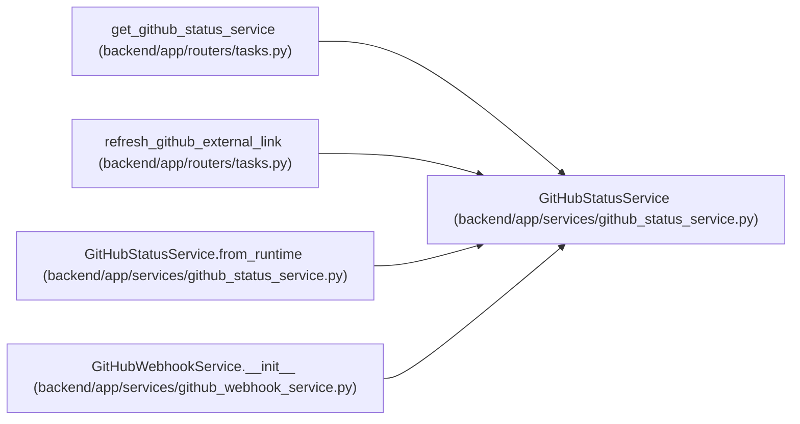

# GitHubStatusService

**Location:** `backend/app/services/github_status_service.py:22`
**Kind:** Class
**Bases:** —
**Module:** [github_status_service](../modules/github_status_service.md)

## Description

Refresh cached GitHub pull request metadata for external links.

## Attributes

*No annotated attributes found.*

## Methods

| Method | Signature | Decorators | Description |
|--------|-----------|------------|-------------|
| `__init__` | `(db: AsyncSession, settings_override = None, transport: Optional[httpx.AsyncBaseTransport] = None)` | — | — |
| `from_runtime` | *(async)* `(db: AsyncSession, transport: Optional[httpx.AsyncBaseTransport] = None) -> 'GitHubStatusService'` | `@classmethod` | Construct the service from DB-backed runtime GitHub settings. |
| `_now_iso` | `() -> str` | — | Return an API-friendly UTC timestamp. |
| `_headers` | `() -> dict[str, str]` | — | Build GitHub request headers. |
| `_pr_metadata` | `(link: ExternalLink) -> tuple[str, str, int]` | — | Extract GitHub PR identity from external link metadata. |
| `status_from_payload` | `(payload: dict[str, Any]) -> str` | — | Normalize GitHub PR state into the external link status field. |
| `_fetch_pull_request` | *(async)* `(owner: str, repo: str, number: int) -> dict[str, Any]` | — | Fetch one pull request payload from GitHub. |
| `_provider_error_message` | `(error: Exception) -> str` | — | Convert provider exceptions into a safe cached message. |
| `_save_link` | *(async)* `(link: ExternalLink) -> ExternalLink` | — | Persist changed link fields. |
| `_reserve_task_context_revision` | *(async)* `(link: ExternalLink, *, outcome: str) -> None` | — | Fence a task assignment before provider data dirties its linked context. |
| `refresh_pull_request_status` | *(async)* `(link_id: int) -> Optional[ExternalLink]` | — | Refresh a GitHub PR link and cache status metadata. |

## Relationships

<!-- Auto-generated relationship summary. Do not edit by hand. -->

### Summary

| Module | Methods | Attributes |
|---|---:|---|
| [github_status_service](../modules/github_status_service.md) | 11 | — |

### References

| Reference | Kind | Source | Call sites |
|---|---|---|---:|
| `get_github_status_service` | type_reference | [tasks](../modules/tasks.md) | — |
| `refresh_github_external_link` | type_reference | [tasks](../modules/tasks.md) | — |
| `GitHubStatusService.from_runtime` | call | [github_status_service](../modules/github_status_service.md) | 1 |
| `GitHubStatusService.from_runtime` | type_reference | [github_status_service](../modules/github_status_service.md) | — |
| `GitHubWebhookService.__init__` | call | [github_webhook_service](../modules/github_webhook_service.md) | 1 |
