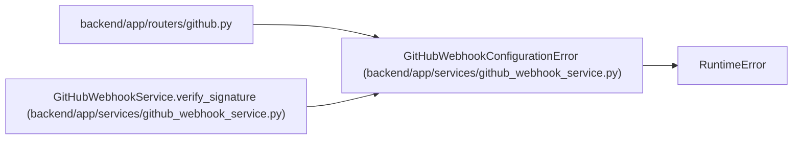

# GitHubWebhookConfigurationError

**Location:** `backend/app/services/github_webhook_service.py:39`
**Kind:** Class
**Bases:** `RuntimeError`
**Module:** [github_webhook_service](../modules/github_webhook_service.md)

## Description

Raised when webhook processing is not configured.

## Attributes

*No annotated attributes found.*

## Methods

*No public methods. Inherits from base classes.*

## Relationships

<!-- Auto-generated relationship summary. Do not edit by hand. -->

### Summary

| Module | Methods | Attributes |
|---|---:|---|
| [github_webhook_service](../modules/github_webhook_service.md) | 0 | — |

### Structure

| Kind | Entity | Module |
|---|---|---|
| Base | `RuntimeError` | — |

### References

| Reference | Kind | Source | Call sites |
|---|---|---|---:|
| `github` | import | [routers_github](../modules/routers_github.md) | — |
| `GitHubWebhookService.verify_signature` | call | [github_webhook_service](../modules/github_webhook_service.md) | 1 |
