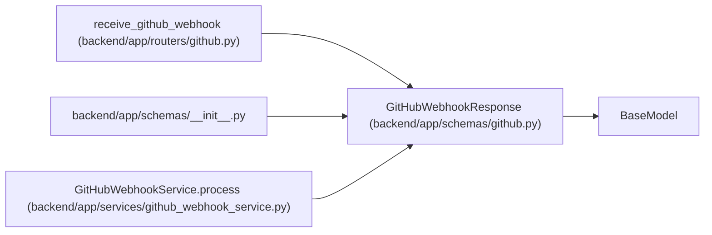

# GitHubWebhookResponse

**Location:** `backend/app/schemas/github.py:72`
**Kind:** Pydantic model
**Bases:** `BaseModel`
**Module:** [schemas_github](../modules/schemas_github.md)

## Description

Response returned after receiving a GitHub webhook delivery.

## Attributes

| Name | Type | Wire name | Required | Nullable | Default | Constraints | Examples | Description |
|------|------|-----------|----------|----------|---------|-------------|-------------|----------|
| `accepted` | `bool` | `accepted` | Yes | No | — | — | — | — |
| `event` | `str` | `event` | Yes | No | — | — | — | — |
| `action` | `Optional[str]` | `action` | No | Yes | `None` | — | — | — |
| `matched` | `bool` | `matched` | No | No | `False` | — | — | — |
| `external_link_id` | `Optional[int]` | `external_link_id` | No | Yes | `None` | — | — | — |
| `task_id` | `Optional[int]` | `task_id` | No | Yes | `None` | — | — | — |
| `triage_item_id` | `Optional[int]` | `triage_item_id` | No | Yes | `None` | — | — | — |
| `ignored_reason` | `Optional[str]` | `ignored_reason` | No | Yes | `None` | — | — | — |
| `automation_results` | `list[GitHubStatusAutomationResult]` | `automation_results` | No | No | factory: `list` | — | — | — |

## Methods

*No public methods. Inherits from base classes.*

## Relationships

<!-- Auto-generated relationship summary. Do not edit by hand. -->

### Summary

| Module | Methods | Attributes |
|---|---:|---|
| [schemas_github](../modules/schemas_github.md) | 0 | `accepted`, `action`, `automation_results`, `event`, `external_link_id`, `ignored_reason`, `matched`, `task_id`, `triage_item_id` |

### Structure

| Kind | Entity | Module |
|---|---|---|
| Base | `BaseModel` | — |

### References

| Reference | Kind | Source | Call sites |
|---|---|---|---:|
| `receive_github_webhook` | type_reference | [routers_github](../modules/routers_github.md) | — |
| `__init__` | import | [schemas___init__](../modules/schemas___init__.md) | — |
| `GitHubWebhookService.process` | call | [github_webhook_service](../modules/github_webhook_service.md) | 6 |
| `GitHubWebhookService.process` | type_reference | [github_webhook_service](../modules/github_webhook_service.md) | — |
