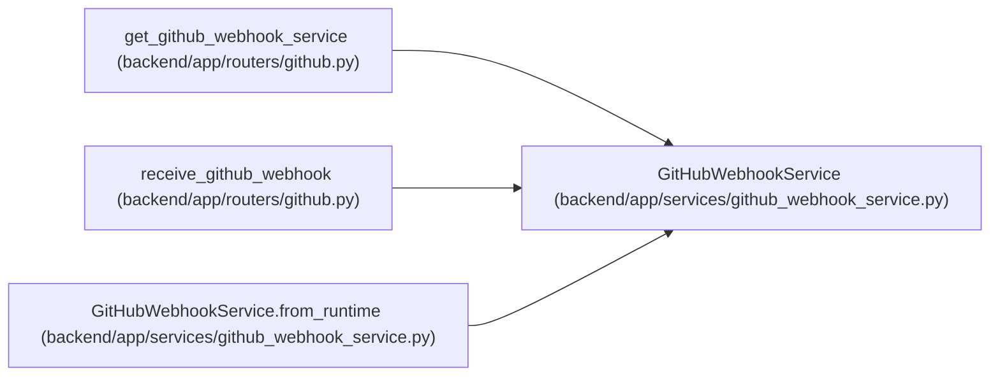

# GitHubWebhookService

**Location:** `backend/app/services/github_webhook_service.py:49`
**Kind:** Class
**Bases:** —
**Module:** [github_webhook_service](../modules/github_webhook_service.md)

## Description

Verify and process GitHub webhook deliveries.

## Attributes

*No annotated attributes found.*

## Methods

| Method | Signature | Decorators | Description |
|--------|-----------|------------|-------------|
| `__init__` | `(db: AsyncSession, settings_override = None)` | — | — |
| `from_runtime` | *(async)* `(db: AsyncSession) -> 'GitHubWebhookService'` | `@classmethod` | Construct the service from DB-backed runtime GitHub settings. |
| `verify_signature` | `(body: bytes, signature_header: Optional[str]) -> None` | — | Verify the GitHub HMAC SHA-256 signature. |
| `parse_payload` | `(body: bytes) -> dict[str, Any]` | — | Parse a JSON webhook body. |
| `_now_iso` | `() -> str` | — | — |
| `_repository_full_name` | `(payload: dict[str, Any]) -> str` | — | — |
| `_pull_request` | `(payload: dict[str, Any]) -> dict[str, Any]` | — | — |
| `_pull_request_number` | `(pr: dict[str, Any]) -> int` | — | — |
| `_external_key` | `(repo_full_name: str, number: int) -> str` | — | — |
| `_sender_login` | `(payload: dict[str, Any]) -> Optional[str]` | — | — |
| `_pull_request_url` | `(pr: dict[str, Any], repo_full_name: str, number: int) -> str` | — | — |
| `_event_type` | `(action: str, status: str) -> str` | — | — |
| `_matching_link` | *(async)* `(repo_full_name: str, number: int) -> Optional[ExternalLink]` | — | — |
| `_event_exists` | *(async)* `(delivery_id: Optional[str]) -> bool` | — | — |
| `_event_payload` | `(*, action: str, delivery_id: Optional[str], repo_full_name: str, number: int, url: str, title: str, status: str, sender: Optional[str], link_id: int, pr: dict[str, Any], ui_language: LanguageCode) -> dict[str, Any]` | — | — |
| `_update_link_from_pr` | *(async)* `(link: ExternalLink, *, action: str, delivery_id: Optional[str], repo_full_name: str, pr: dict[str, Any], sender: Optional[str]) -> str` | — | — |
| `_existing_triage_item` | *(async)* `(external_key: str) -> Optional[TriageItem]` | — | — |
| `_create_or_get_triage_item` | *(async)* `(*, external_key: str, repo_full_name: str, number: int, title: str, url: str, action: str, status: str, sender: Optional[str]) -> TriageItem` | — | — |
| `process` | *(async)* `(event: str, delivery_id: Optional[str], payload: dict[str, Any]) -> GitHubWebhookResponse` | — | Process one verified GitHub webhook payload. |

## Relationships

<!-- Auto-generated relationship summary. Do not edit by hand. -->

### Summary

| Module | Methods | Attributes |
|---|---:|---|
| [github_webhook_service](../modules/github_webhook_service.md) | 19 | — |

### References

| Reference | Kind | Source | Call sites |
|---|---|---|---:|
| `get_github_webhook_service` | type_reference | [routers_github](../modules/routers_github.md) | — |
| `receive_github_webhook` | type_reference | [routers_github](../modules/routers_github.md) | — |
| `GitHubWebhookService.from_runtime` | call | [github_webhook_service](../modules/github_webhook_service.md) | 1 |
| `GitHubWebhookService.from_runtime` | type_reference | [github_webhook_service](../modules/github_webhook_service.md) | — |
