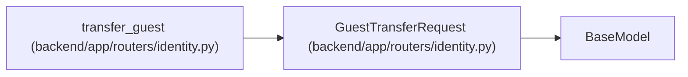

# GuestTransferRequest

**Location:** `backend/app/routers/identity.py:43`
**Kind:** Pydantic model
**Bases:** `BaseModel`
**Module:** [routers_identity](../modules/routers_identity.md)

## Description

_Auto-generated from `GuestTransferRequest` in `backend/app/routers/identity.py`._

## Attributes

| Name | Type | Wire name | Required | Nullable | Default | Constraints | Examples | Description |
|------|------|-----------|----------|----------|---------|-------------|-------------|----------|
| `guest_token` | `str \| None` | `guest_token` | No | Yes | `None` | max_length=128 | — | — |
| `guest_session_id` | `int \| None` | `guest_session_id` | No | Yes | `None` | ge=1 | — | — |
| `principal_id` | `int \| None` | `principal_id` | No | Yes | `None` | ge=1 | — | — |
| `reason` | `str \| None` | `reason` | No | Yes | `None` | max_length=2000 | — | — |

## Methods

*No public methods. Inherits from base classes.*

## Relationships

<!-- Auto-generated relationship summary. Do not edit by hand. -->

### Summary

| Module | Methods | Attributes |
|---|---:|---|
| [routers_identity](../modules/routers_identity.md) | 0 | `guest_session_id`, `guest_token`, `principal_id`, `reason` |

### Structure

| Kind | Entity | Module |
|---|---|---|
| Base | `BaseModel` | — |

### References

| Reference | Kind | Source | Call sites |
|---|---|---|---:|
| `transfer_guest` | type_reference | [routers_identity](../modules/routers_identity.md) | — |
