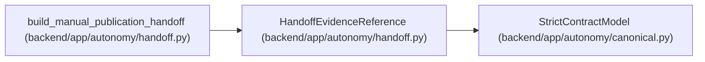

# HandoffEvidenceReference

**Location:** `backend/app/autonomy/handoff.py:68`
**Kind:** Pydantic model
**Bases:** `StrictContractModel`
**Module:** [handoff](../modules/handoff.md)

## Description

_Auto-generated from `HandoffEvidenceReference` in `backend/app/autonomy/handoff.py`._

## Attributes

| Name | Type | Wire name | Required | Nullable | Default | Constraints | Examples | Description |
|------|------|-----------|----------|----------|---------|-------------|-------------|----------|
| `fact_kind` | `str` | `fact_kind` | Yes | No | — | pattern=unknown (IDENTIFIER_PATTERN) | — | — |
| `immutable_uri` | `str` | `immutable_uri` | Yes | No | — | min_length=1; max_length=2048 | — | — |
| `object_digest` | `str` | `object_digest` | Yes | No | — | pattern=unknown (SHA256_PATTERN) | — | — |
| `issuer_workload_identity` | `str` | `issuer_workload_identity` | Yes | No | — | min_length=1; max_length=512 | — | — |
| `issuer_role` | `str` | `issuer_role` | Yes | No | — | pattern=unknown (IDENTIFIER_PATTERN) | — | — |
| `source_system` | `str` | `source_system` | Yes | No | — | pattern=unknown (IDENTIFIER_PATTERN) | — | — |
| `source_generation` | `str` | `source_generation` | Yes | No | — | min_length=1; max_length=255 | — | — |

## Methods

*No public methods. Inherits from base classes.*

## Relationships

<!-- Auto-generated relationship summary. Do not edit by hand. -->

### Summary

| Module | Methods | Attributes |
|---|---:|---|
| [handoff](../modules/handoff.md) | 0 | `fact_kind`, `immutable_uri`, `issuer_role`, `issuer_workload_identity`, `object_digest`, `source_generation`, `source_system` |

### Structure

| Kind | Entity | Module |
|---|---|---|
| Base | `StrictContractModel` | [autonomy_canonical](../modules/autonomy_canonical.md) |

### References

| Reference | Kind | Source | Call sites |
|---|---|---|---:|
| `build_manual_publication_handoff` | call | [handoff](../modules/handoff.md) | 1 |
