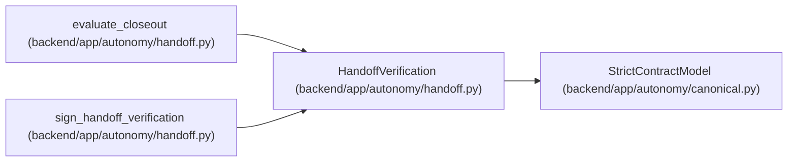

# HandoffVerification

**Location:** `backend/app/autonomy/handoff.py:142`
**Kind:** Pydantic model
**Bases:** `StrictContractModel`
**Module:** [handoff](../modules/handoff.md)

## Description

_Auto-generated from `HandoffVerification` in `backend/app/autonomy/handoff.py`._

## Validators

| Method | Scope | Fields | Mode | Options |
|--------|-------|--------|------|---------|
| `aware_verification_time` | field | verified_at | after | — |

## Attributes

| Name | Type | Wire name | Required | Nullable | Default | Constraints | Examples | Description |
|------|------|-----------|----------|----------|---------|-------------|-------------|----------|
| `schema_version` | `Literal['manual-publication-handoff-verification-v1']` | `schema_version` | No | No | `'manual-publication-handoff-verification-v1'` | — | — | — |
| `handoff_digest` | `str` | `handoff_digest` | Yes | No | — | pattern=unknown (SHA256_PATTERN) | — | — |
| `verifier_identity` | `Literal['pg-release-verifier']` | `verifier_identity` | No | No | `'pg-release-verifier'` | — | — | — |
| `verified_at` | `datetime` | `verified_at` | Yes | No | — | — | — | — |
| `evidence_graph_digest` | `str` | `evidence_graph_digest` | Yes | No | — | pattern=unknown (SHA256_PATTERN) | — | — |
| `candidate_notes_sha256` | `str` | `candidate_notes_sha256` | Yes | No | — | pattern=unknown (SHA256_PATTERN) | — | — |
| `conclusion` | `Literal['verified']` | `conclusion` | No | No | `'verified'` | — | — | — |

## Methods

| Method | Signature | Decorators | Description |
|--------|-----------|------------|-------------|
| `aware_verification_time` | `(value: datetime) -> datetime` | `@field_validator('verified_at')`, `@classmethod` | — |

## Relationships

<!-- Auto-generated relationship summary. Do not edit by hand. -->

### Summary

| Module | Methods | Attributes |
|---|---:|---|
| [handoff](../modules/handoff.md) | 1 | `candidate_notes_sha256`, `conclusion`, `evidence_graph_digest`, `handoff_digest`, `schema_version`, `verified_at`, `verifier_identity` |

### Structure

| Kind | Entity | Module |
|---|---|---|
| Base | `StrictContractModel` | [autonomy_canonical](../modules/autonomy_canonical.md) |

### References

| Reference | Kind | Source | Call sites |
|---|---|---|---:|
| `evaluate_closeout` | type_reference | [handoff](../modules/handoff.md) | — |
| `sign_handoff_verification` | call | [handoff](../modules/handoff.md) | 1 |
| `sign_handoff_verification` | type_reference | [handoff](../modules/handoff.md) | — |
