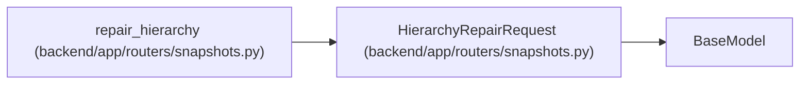

# HierarchyRepairRequest

**Location:** `backend/app/routers/snapshots.py:241`
**Kind:** Pydantic model
**Bases:** `BaseModel`
**Module:** [snapshots](../modules/snapshots.md)

## Description

_Auto-generated from `HierarchyRepairRequest` in `backend/app/routers/snapshots.py`._

## Attributes

| Name | Type | Wire name | Required | Nullable | Default | Constraints | Examples | Description |
|------|------|-----------|----------|----------|---------|-------------|-------------|----------|
| `apply` | `bool` | `apply` | No | No | `False` | — | — | — |
| `expected_versions` | `dict[int, int]` | `expected_versions` | No | No | factory: `dict` | — | — | — |
| `expected_revision` | `int \| None` | `expected_revision` | No | Yes | `None` | ge=1 | — | — |
| `reason` | `str` | `reason` | No | No | `''` | max_length=2000 | — | — |
| `after_id` | `int` | `after_id` | No | No | `0` | ge=0 | — | — |
| `limit` | `int` | `limit` | No | No | `100` | ge=1; le=500 | — | — |

## Methods

*No public methods. Inherits from base classes.*

## Relationships

<!-- Auto-generated relationship summary. Do not edit by hand. -->

### Summary

| Module | Methods | Attributes |
|---|---:|---|
| [snapshots](../modules/snapshots.md) | 0 | `after_id`, `apply`, `expected_revision`, `expected_versions`, `limit`, `reason` |

### Structure

| Kind | Entity | Module |
|---|---|---|
| Base | `BaseModel` | — |

### References

| Reference | Kind | Source | Call sites |
|---|---|---|---:|
| `repair_hierarchy` | type_reference | [snapshots](../modules/snapshots.md) | — |
