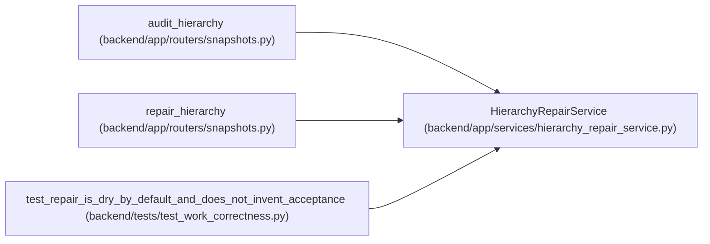

# HierarchyRepairService

**Location:** `backend/app/services/hierarchy_repair_service.py:14`
**Kind:** Class
**Bases:** —
**Module:** [hierarchy_repair_service](../modules/hierarchy_repair_service.md)

## Description

_Auto-generated from `HierarchyRepairService` in `backend/app/services/hierarchy_repair_service.py`._

## Attributes

*No annotated attributes found.*

## Methods

| Method | Signature | Decorators | Description |
|--------|-----------|------------|-------------|
| `__init__` | `(db)` | — | — |
| `audit` | *(async)* `(iteration_id, *, after_id = 0, limit = 100)` | — | — |
| `repair` | *(async)* `(iteration_id, *, expected_versions, reason, after_id = 0, limit = 100, expected_revision = None)` | `@atomic_command` | — |

## Relationships

<!-- Auto-generated relationship summary. Do not edit by hand. -->

### Summary

| Module | Methods | Attributes |
|---|---:|---|
| [hierarchy_repair_service](../modules/hierarchy_repair_service.md) | 3 | — |

### References

| Reference | Kind | Source | Call sites |
|---|---|---|---:|
| `audit_hierarchy` | call | [snapshots](../modules/snapshots.md) | 1 |
| `repair_hierarchy` | call | [snapshots](../modules/snapshots.md) | 1 |
| `test_repair_is_dry_by_default_and_does_not_invent_acceptance` | call | [test_work_correctness](../modules/test_work_correctness.md) | 1 |
