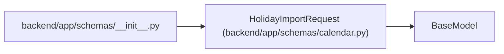

# HolidayImportRequest

**Location:** `backend/app/schemas/calendar.py:77`
**Kind:** Pydantic model
**Bases:** `BaseModel`
**Module:** [schemas_calendar](../modules/schemas_calendar.md)

## Description

Request for importing holidays from external source.

## Attributes

| Name | Type | Wire name | Required | Nullable | Default | Constraints | Examples | Description |
|------|------|-----------|----------|----------|---------|-------------|-------------|----------|
| `source` | `str` | `source` | Yes | No | — | — | — | 'internet' or 'corporate' |
| `url` | `Optional[str]` | `url` | No | Yes | `None` | — | — | URL for corporate source |
| `country` | `Optional[str]` | `country` | No | Yes | `None` | — | — | Country code for internet source |
| `year` | `Optional[int]` | `year` | No | Yes | `None` | — | — | — |

## Methods

*No public methods. Inherits from base classes.*

## Relationships

<!-- Auto-generated relationship summary. Do not edit by hand. -->

### Summary

| Module | Methods | Attributes |
|---|---:|---|
| [schemas_calendar](../modules/schemas_calendar.md) | 0 | `country`, `source`, `url`, `year` |

### Structure

| Kind | Entity | Module |
|---|---|---|
| Base | `BaseModel` | — |

### References

| Reference | Kind | Source | Call sites |
|---|---|---|---:|
| `__init__` | import | [schemas___init__](../modules/schemas___init__.md) | — |
