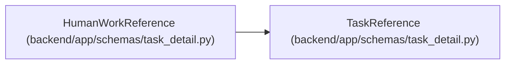

# HumanWorkReference

**Location:** `backend/app/schemas/task_detail.py:43`
**Kind:** Pydantic model
**Bases:** `TaskReference`
**Module:** [task_detail](../modules/task_detail.md)

## Description

Enriches a bounded task reference with current server action availability for authenticated human work. Project/backlog and parent context remain explicit; execution context is not inferred from this projection.

## Attributes

| Name | Type | Wire name | Required | Nullable | Default | Constraints | Examples | Description |
|------|------|-----------|----------|----------|---------|-------------|-------------|----------|
| `actions` | `list[TaskActionAvailability]` | `actions` | Yes | No | — | — | — | — |

## Methods

*No public methods. Inherits from base classes.*

## Relationships

<!-- Auto-generated relationship summary. Do not edit by hand. -->

### Summary

| Module | Methods | Attributes |
|---|---:|---|
| [task_detail](../modules/task_detail.md) | 0 | `actions` |

### Structure

| Kind | Entity | Module |
|---|---|---|
| Base | `TaskReference` | [task_detail](../modules/task_detail.md) |
