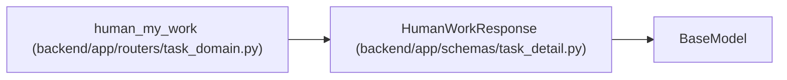

# HumanWorkResponse

**Location:** `backend/app/schemas/task_detail.py:47`
**Kind:** Pydantic model
**Bases:** `BaseModel`
**Module:** [task_detail](../modules/task_detail.md)

## Description

Carries explicit human ownership state, categorized reference queues and live cursor metadata. A missing profile or membership has its own state rather than an unscoped team-work fallback.

## Attributes

| Name | Type | Wire name | Required | Nullable | Default | Constraints | Examples | Description |
|------|------|-----------|----------|----------|---------|-------------|-------------|----------|
| `state` | `str` | `state` | Yes | No | — | — | — | — |
| `queues` | `dict[str, list[HumanWorkReference]]` | `queues` | Yes | No | — | — | — | — |
| `has_more` | `bool` | `has_more` | Yes | No | — | — | — | — |
| `next_after_id` | `int \| None` | `next_after_id` | Yes | Yes | — | — | — | — |

## Methods

*No public methods. Inherits from base classes.*

## Relationships

<!-- Auto-generated relationship summary. Do not edit by hand. -->

### Summary

| Module | Methods | Attributes |
|---|---:|---|
| [task_detail](../modules/task_detail.md) | 0 | `has_more`, `next_after_id`, `queues`, `state` |

### Structure

| Kind | Entity | Module |
|---|---|---|
| Base | `BaseModel` | — |

### References

| Reference | Kind | Source | Call sites |
|---|---|---|---:|
| `human_my_work` | type_reference | [routers_task_domain](../modules/routers_task_domain.md) | — |
