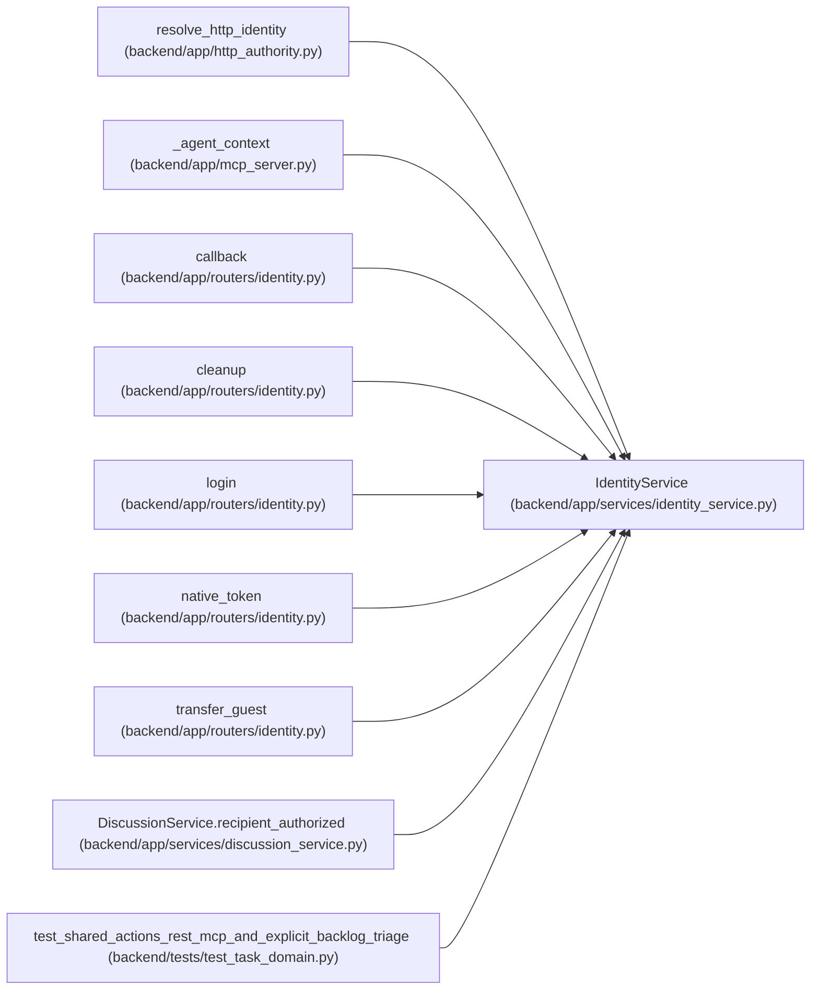

# IdentityService

**Location:** `backend/app/services/identity_service.py:130`
**Kind:** Class
**Bases:** —
**Module:** [identity_service](../modules/identity_service.md)

## Description

_Auto-generated from `IdentityService` in `backend/app/services/identity_service.py`._

OIDC authorization-code sign-in verifies PKCE, browser-bound state, nonce, RS256 signature, issuer, audience, expiry and token bindings before mapping the stable issuer/subject. Sessions are opaque and revocable. Guest ownership transfer requires token proof or reasoned operator recovery, preserves original attribution, and rotates share links. Bounded retention anonymizes expired metadata while retaining referenced identity rows.

## Attributes

*No annotated attributes found.*

## Methods

| Method | Signature | Decorators | Description |
|--------|-----------|------------|-------------|
| `__init__` | `(db)` | — | — |
| `context` | *(async)* `(principal: Principal, *, actor = None, session = None, source = 'rest')` | — | — |
| `actor_context` | *(async)* `(actor, *, source = 'rest')` | — | — |
| `begin_login` | *(async)* `(return_path = '/')` | `@atomic_command` | — |
| `finish_login` | *(async)* `(code, state, browser, *, ip_address, user_agent)` | `@atomic_command` | — |
| `issue_session` | *(async)* `(principal_id, ip_address, user_agent)` | — | — |
| `transfer_guest` | *(async)* `(raw_token, principal_id, *, operator_reason = None, guest_id = None)` | `@atomic_command` | — |
| `cleanup_sessions` | *(async)* `(*, limit = 100)` | `@atomic_command` | — |

## Relationships

<!-- Auto-generated relationship summary. Do not edit by hand. -->

### Summary

| Module | Methods | Attributes |
|---|---:|---|
| [identity_service](../modules/identity_service.md) | 8 | — |

### References

| Reference | Kind | Source | Call sites |
|---|---|---|---:|
| `resolve_http_identity` | call | [http_authority](../modules/http_authority.md) | 1 |
| `_agent_context` | call | [mcp_server](../modules/mcp_server.md) | 1 |
| `callback` | call | [routers_identity](../modules/routers_identity.md) | 1 |
| `cleanup` | call | [routers_identity](../modules/routers_identity.md) | 1 |
| `login` | call | [routers_identity](../modules/routers_identity.md) | 1 |
| `native_token` | call | [routers_identity](../modules/routers_identity.md) | 1 |
| `transfer_guest` | call | [routers_identity](../modules/routers_identity.md) | 1 |
| `DiscussionService.recipient_authorized` | call | [discussion_service](../modules/discussion_service.md) | 1 |
| `test_shared_actions_rest_mcp_and_explicit_backlog_triage` | call | [test_task_domain](../modules/test_task_domain.md) | 1 |
