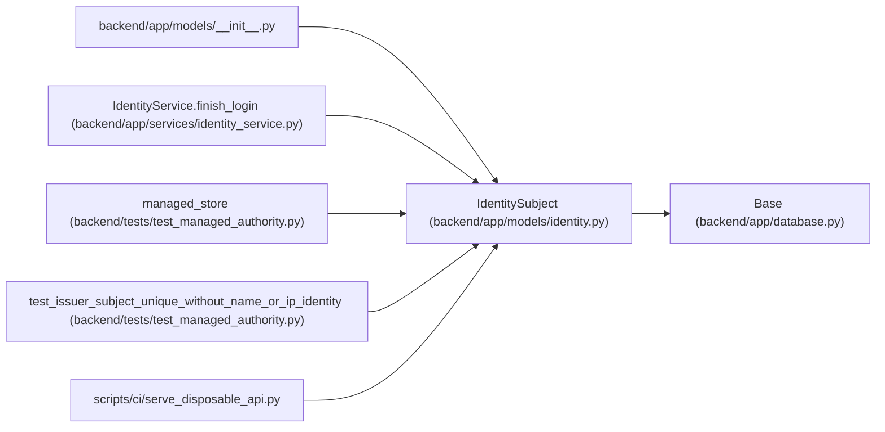

# IdentitySubject

**Location:** `backend/app/models/identity.py:23`
**Kind:** Class
**Bases:** `Base`
**Module:** [models_identity](../modules/models_identity.md)

## Description

_Auto-generated from `IdentitySubject` in `backend/app/models/identity.py`._

## Attributes

| Name | Type | Default | Description |
|------|------|---------|-------------|
| `id` | `Mapped[int]` | `mapped_column(Integer, primary_key=True)` | — |
| `principal_id` | `Mapped[int]` | `mapped_column(ForeignKey('principals.id', ondelete='CASCADE'), index=True)` | — |
| `issuer` | `Mapped[str]` | `mapped_column(String(512), nullable=False)` | — |
| `subject` | `Mapped[str]` | `mapped_column(String(255), nullable=False)` | — |
| `created_at` | `Mapped[datetime]` | `mapped_column(UTCDateTime(), default=utc_now)` | — |

## Methods

*No public methods. Inherits from base classes.*

## Relationships

<!-- Auto-generated relationship summary. Do not edit by hand. -->

### Summary

| Module | Methods | Attributes |
|---|---:|---|
| [models_identity](../modules/models_identity.md) | 0 | `created_at`, `id`, `issuer`, `principal_id`, `subject` |

### Structure

| Kind | Entity | Module |
|---|---|---|
| Base | `Base` | [app_database](../modules/app_database.md) |

### References

| Reference | Kind | Source | Call sites |
|---|---|---|---:|
| `__init__` | import | [models___init__](../modules/models___init__.md) | — |
| `IdentityService.finish_login` | call | [identity_service](../modules/identity_service.md) | 1 |
| `managed_store` | call | [test_managed_authority](../modules/test_managed_authority.md) | 1 |
| `test_issuer_subject_unique_without_name_or_ip_identity` | call | [test_managed_authority](../modules/test_managed_authority.md) | 1 |
| `serve_disposable_api` | import | [serve_disposable_api](../modules/serve_disposable_api.md) | — |
