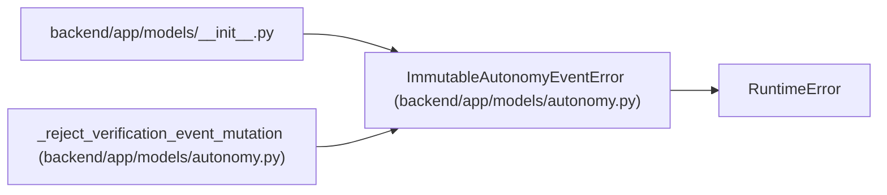

# ImmutableAutonomyEventError

**Location:** `backend/app/models/autonomy.py:368`
**Kind:** Class
**Bases:** `RuntimeError`
**Module:** [models_autonomy](../modules/models_autonomy.md)

## Description

_Auto-generated from `ImmutableAutonomyEventError` in `backend/app/models/autonomy.py`._

## Attributes

*No annotated attributes found.*

## Methods

*No public methods. Inherits from base classes.*

## Relationships

<!-- Auto-generated relationship summary. Do not edit by hand. -->

### Summary

| Module | Methods | Attributes |
|---|---:|---|
| [models_autonomy](../modules/models_autonomy.md) | 0 | — |

### Structure

| Kind | Entity | Module |
|---|---|---|
| Base | `RuntimeError` | — |

### References

| Reference | Kind | Source | Call sites |
|---|---|---|---:|
| `__init__` | import | [models___init__](../modules/models___init__.md) | — |
| `_reject_verification_event_mutation` | call | [models_autonomy](../modules/models_autonomy.md) | 1 |
