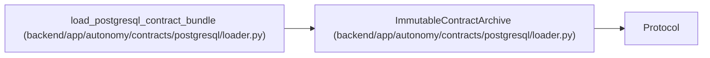

# ImmutableContractArchive

**Location:** `backend/app/autonomy/contracts/postgresql/loader.py:142`
**Kind:** Class
**Bases:** `Protocol`
**Module:** [loader](../modules/loader.md)

**Decorators:** `@runtime_checkable`

## Description

Read exact charter-pinned immutable input bytes by logical key/digest.

## Attributes

*No annotated attributes found.*

## Methods

| Method | Signature | Decorators | Description |
|--------|-----------|------------|-------------|
| `get_exact` | `(*, logical_key: str, expected_sha256: str) -> bytes` | — | — |

## Relationships

<!-- Auto-generated relationship summary. Do not edit by hand. -->

### Summary

| Module | Methods | Attributes |
|---|---:|---|
| [loader](../modules/loader.md) | 1 | — |

### Structure

| Kind | Entity | Module |
|---|---|---|
| Base | `Protocol` | — |

### References

| Reference | Kind | Source | Call sites |
|---|---|---|---:|
| `load_postgresql_contract_bundle` | type_reference | [loader](../modules/loader.md) | — |
