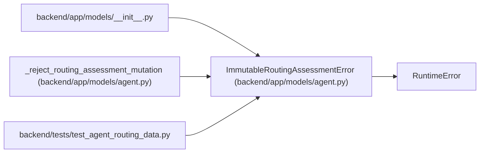

# ImmutableRoutingAssessmentError

**Location:** `backend/app/models/agent.py:838`
**Kind:** Class
**Bases:** `RuntimeError`
**Module:** [models_agent](../modules/models_agent.md)

## Description

Raised when application code attempts to mutate append-only evidence.

## Attributes

*No annotated attributes found.*

## Methods

*No public methods. Inherits from base classes.*

## Relationships

<!-- Auto-generated relationship summary. Do not edit by hand. -->

### Summary

| Module | Methods | Attributes |
|---|---:|---|
| [models_agent](../modules/models_agent.md) | 0 | — |

### Structure

| Kind | Entity | Module |
|---|---|---|
| Base | `RuntimeError` | — |

### References

| Reference | Kind | Source | Call sites |
|---|---|---|---:|
| `__init__` | import | [models___init__](../modules/models___init__.md) | — |
| `_reject_routing_assessment_mutation` | call | [models_agent](../modules/models_agent.md) | 1 |
| `test_agent_routing_data` | import | [test_agent_routing_data](../modules/test_agent_routing_data.md) | — |
