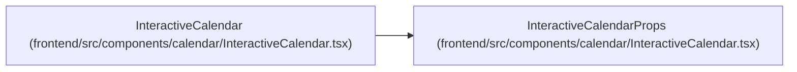

# InteractiveCalendarProps

**Location:** `frontend/src/components/calendar/InteractiveCalendar.tsx:20`
**Kind:** Class
**Bases:** —
**Module:** [InteractiveCalendar](../modules/InteractiveCalendar.md)

## Description

_Auto-generated from `InteractiveCalendarProps` in `frontend/src/components/calendar/InteractiveCalendar.tsx`._

## Attributes

| Name | Type | Default | Description |
|------|------|---------|-------------|
| `year` | `number` | *required* | — |
| `month` | `number` | *required* | — |
| `holidays` | `string[]` | *required* | — |
| `shortDays` | `string[]` | *required* | — |
| `weekendDays` | `number[]` | *required* | — |
| `onYearChange` | `(year: number) => void` | *required* | — |
| `onMonthChange` | `(month: number) => void` | *required* | — |
| `onAddHoliday` | `(date: string) => void` | *required* | — |
| `onRemoveHoliday` | `(date: string) => void` | *required* | — |
| `onAddShortDay` | `(date: string) => void` | *required* | — |
| `onRemoveShortDay` | `(date: string) => void` | *required* | — |
| `onToggleWeekend` | `(day: number) => void` | *required* | — |

## Methods

*No public methods. Inherits from base classes.*

## Relationships

<!-- Auto-generated relationship summary. Do not edit by hand. -->

### Summary

| Module | Methods | Attributes |
|---|---:|---|
| [InteractiveCalendar](../modules/InteractiveCalendar.md) | 0 | `holidays`, `month`, `onAddHoliday`, `onAddShortDay`, `onMonthChange`, `onRemoveHoliday`, `onRemoveShortDay`, `onToggleWeekend`, `onYearChange`, `shortDays`, `weekendDays`, `year` |

### References

| Reference | Kind | Source | Call sites |
|---|---|---|---:|
| `InteractiveCalendar` | type_reference | [InteractiveCalendar](../modules/InteractiveCalendar.md) | — |
