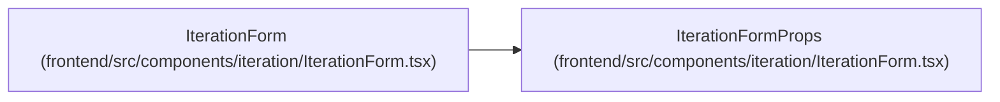

# IterationFormProps

**Location:** `frontend/src/components/iteration/IterationForm.tsx:24`
**Kind:** Class
**Bases:** —
**Module:** [IterationForm](../modules/IterationForm.md)

## Description

_Auto-generated from `IterationFormProps` in `frontend/src/components/iteration/IterationForm.tsx`._

## Attributes

| Name | Type | Required | Default | Description |
|------|------|----------|---------|-------------|
| `initialData` | `Iteration` | No | — | — |
| `lockedProject` | `{         id: number;         name: string;     }` | No | — | — |
| `hideProjectScope` | `boolean` | No | — | — |
| `onSuccess` | `(iteration?: Iteration, iterations?: Iteration[]) => void` | Yes | — | — |
| `onCancel` | `() => void` | Yes | — | — |
| `onStateChange` | `(state: { dirty: boolean; pending: boolean }) => void` | No | — | — |

## Methods

*No public methods. Inherits from base classes.*

## Relationships

<!-- Auto-generated relationship summary. Do not edit by hand. -->

### Summary

| Module | Methods | Attributes |
|---|---:|---|
| [IterationForm](../modules/IterationForm.md) | 0 | `hideProjectScope`, `initialData`, `lockedProject`, `onCancel`, `onStateChange`, `onSuccess` |

### References

| Reference | Kind | Source | Call sites |
|---|---|---|---:|
| `IterationForm` | type_reference | [IterationForm](../modules/IterationForm.md) | — |
