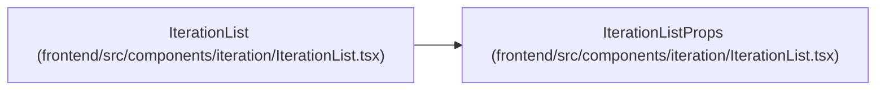

# IterationListProps

**Location:** `frontend/src/components/iteration/IterationList.tsx:16`
**Kind:** Class
**Bases:** —
**Module:** [IterationList](../modules/IterationList.md)

## Description

_Auto-generated from `IterationListProps` in `frontend/src/components/iteration/IterationList.tsx`._

## Attributes

| Name | Type | Default | Description |
|------|------|---------|-------------|
| `onEdit` | `(iteration: Iteration) => void` | *required* | — |

## Methods

*No public methods. Inherits from base classes.*

## Relationships

<!-- Auto-generated relationship summary. Do not edit by hand. -->

### Summary

| Module | Methods | Attributes |
|---|---:|---|
| [IterationList](../modules/IterationList.md) | 0 | `onEdit` |

### References

| Reference | Kind | Source | Call sites |
|---|---|---|---:|
| `IterationList` | type_reference | [IterationList](../modules/IterationList.md) | — |
