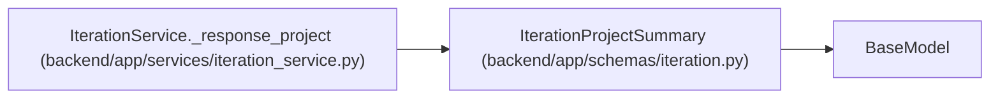

# IterationProjectSummary

**Location:** `backend/app/schemas/iteration.py:59`
**Kind:** Pydantic model
**Bases:** `BaseModel`
**Module:** [schemas_iteration](../modules/schemas_iteration.md)

## Description

Compact project identity embedded in iteration responses.

## Model Configuration

| Setting | Value | Source |
|---------|-------|--------|
| `from_attributes` | `True` | config_class |

## Attributes

| Name | Type | Wire name | Required | Nullable | Default | Constraints | Examples | Description |
|------|------|-----------|----------|----------|---------|-------------|-------------|----------|
| `id` | `int` | `id` | Yes | No | — | — | — | — |
| `name` | `str` | `name` | Yes | No | — | — | — | — |
| `status` | `str` | `status` | Yes | No | — | — | — | — |
| `health` | `str` | `health` | Yes | No | — | — | — | — |

## Methods

*No public methods. Inherits from base classes.*

## Relationships

<!-- Auto-generated relationship summary. Do not edit by hand. -->

### Summary

| Module | Methods | Attributes |
|---|---:|---|
| [schemas_iteration](../modules/schemas_iteration.md) | 0 | `health`, `id`, `name`, `status` |

### Structure

| Kind | Entity | Module |
|---|---|---|
| Base | `BaseModel` | — |

### References

| Reference | Kind | Source | Call sites |
|---|---|---|---:|
| `IterationService._response_project` | type_reference | [iteration_service](../modules/iteration_service.md) | — |
