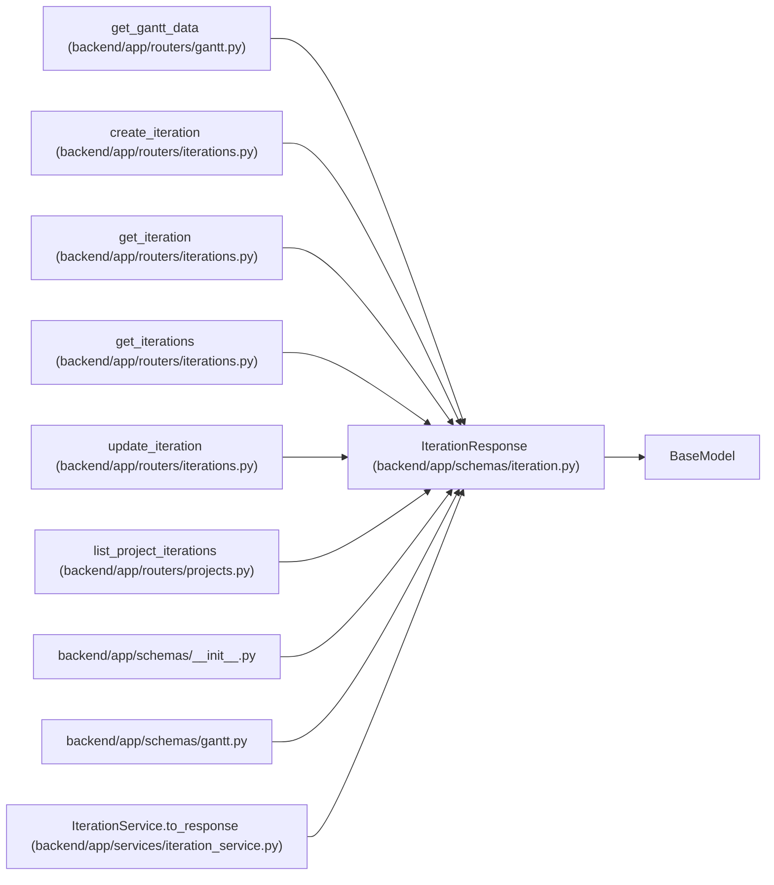

# IterationResponse

**Location:** `backend/app/schemas/iteration.py:70`
**Kind:** Pydantic model
**Bases:** `BaseModel`
**Module:** [schemas_iteration](../modules/schemas_iteration.md)

## Description

_Auto-generated from `IterationResponse` in `backend/app/schemas/iteration.py`._

## Model Configuration

| Setting | Value | Source |
|---------|-------|--------|
| `from_attributes` | `True` | config_class |

## Attributes

| Name | Type | Wire name | Required | Nullable | Default | Constraints | Examples | Description |
|------|------|-----------|----------|----------|---------|-------------|-------------|----------|
| `nominal_day_hours` | `float` | `nominal_day_hours` | No | No | `8` | — | — | — |
| `revision` | `int` | `revision` | No | No | `1` | — | — | — |
| `id` | `int` | `id` | Yes | No | — | — | — | — |
| `name` | `str` | `name` | Yes | No | — | — | — | — |
| `calendar_id` | `int` | `calendar_id` | Yes | No | — | — | — | — |
| `project_id` | `Optional[int]` | `project_id` | No | Yes | `None` | — | — | — |
| `project` | `Optional[IterationProjectSummary]` | `project` | No | Yes | `None` | — | — | — |
| `start_date` | `date` | `start_date` | Yes | No | — | — | — | — |
| `end_date` | `date` | `end_date` | Yes | No | — | — | — | — |
| `manager_email` | `Optional[str]` | `manager_email` | No | Yes | `None` | — | — | — |
| `working_days` | `int` | `working_days` | No | No | `0` | — | — | — |

## Methods

*No public methods. Inherits from base classes.*

## Relationships

<!-- Auto-generated relationship summary. Do not edit by hand. -->

### Summary

| Module | Methods | Attributes |
|---|---:|---|
| [schemas_iteration](../modules/schemas_iteration.md) | 0 | `calendar_id`, `end_date`, `id`, `manager_email`, `name`, `nominal_day_hours`, `project`, `project_id`, `revision`, `start_date`, `working_days` |

### Structure

| Kind | Entity | Module |
|---|---|---|
| Base | `BaseModel` | — |

### References

| Reference | Kind | Source | Call sites |
|---|---|---|---:|
| `get_gantt_data` | call | [routers_gantt](../modules/routers_gantt.md) | 1 |
| `create_iteration` | type_reference | [iterations](../modules/iterations.md) | — |
| `get_iteration` | type_reference | [iterations](../modules/iterations.md) | — |
| `get_iterations` | type_reference | [iterations](../modules/iterations.md) | — |
| `update_iteration` | type_reference | [iterations](../modules/iterations.md) | — |
| `list_project_iterations` | type_reference | [projects](../modules/projects.md) | — |
| `__init__` | import | [schemas___init__](../modules/schemas___init__.md) | — |
| `gantt` | import | [schemas_gantt](../modules/schemas_gantt.md) | — |
| `IterationService.to_response` | call | [iteration_service](../modules/iteration_service.md) | 1 |
| `IterationService.to_response` | type_reference | [iteration_service](../modules/iteration_service.md) | — |
