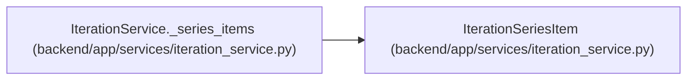

# IterationSeriesItem

**Location:** `backend/app/services/iteration_service.py:35`
**Kind:** Class
**Bases:** —
**Module:** [iteration_service](../modules/iteration_service.md)

**Decorators:** `@dataclass(frozen=True)`

## Description

Computed iteration row for a series create request.

## Attributes

| Name | Type | Default | Description |
|------|------|---------|-------------|
| `name` | `str` | *required* | — |
| `start_date` | `date` | *required* | — |
| `end_date` | `date` | *required* | — |

## Methods

*No public methods. Inherits from base classes.*

## Relationships

<!-- Auto-generated relationship summary. Do not edit by hand. -->

### Summary

| Module | Methods | Attributes |
|---|---:|---|
| [iteration_service](../modules/iteration_service.md) | 0 | `end_date`, `name`, `start_date` |

### References

| Reference | Kind | Source | Call sites |
|---|---|---|---:|
| `IterationService._series_items` | call | [iteration_service](../modules/iteration_service.md) | 2 |
| `IterationService._series_items` | type_reference | [iteration_service](../modules/iteration_service.md) | — |
