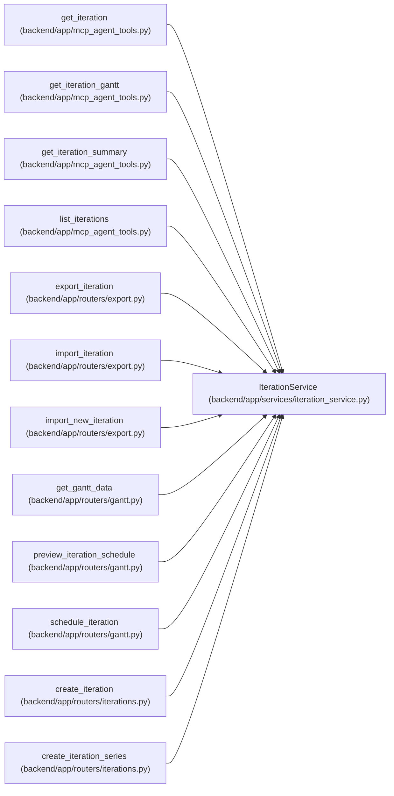

# IterationService

**Location:** `backend/app/services/iteration_service.py:44`
**Kind:** Class
**Bases:** —
**Module:** [iteration_service](../modules/iteration_service.md)

## Description

Service for iteration operations.

Calendar reassignment refreshes nominal workday and derived effort-day values under the existing planning transaction and version reservations. Canonical hours, unknown or zero estimates, estimate provenance and actual execution records are preserved.

## Attributes

*No annotated attributes found.*

## Methods

| Method | Signature | Decorators | Description |
|--------|-----------|------------|-------------|
| `__init__` | `(db: AsyncSession)` | — | — |
| `_response_project` | `(iteration: Iteration) -> Optional[IterationProjectSummary]` | — | Return compact project scope data for iteration responses. |
| `to_response` | `(iteration: Iteration) -> IterationResponse` | — | Build a public iteration response with computed calendar days. |
| `_project_exists` | *(async)* `(project_id: int) -> bool` | — | Return whether a project exists without loading the full project graph. |
| `_require_project_exists` | *(async)* `(project_id: Optional[int]) -> None` | — | Validate an optional iteration project scope. |
| `_calendar_id_for_create` | *(async)* `(calendar_id: Optional[int], *, commit: bool = True) -> int` | — | Return an explicit or default calendar id for new iterations. |
| `_validate_date_range` | `(start_date: date, end_date: date) -> None` | — | Reject inverted iteration periods. |
| `_series_name` | `(base_name: str, index: int) -> str` | — | Increment a trailing number, or append a sequence number. |
| `_series_items` | `(data: IterationSeriesCreate) -> list[IterationSeriesItem]` | — | Compute all rows for a back-to-back iteration series before writing. |
| `_milestone_matches_project` | *(async)* `(milestone_id: Optional[int], project_id: int) -> bool` | — | Return whether a milestone belongs to a project. |
| `_reconcile_tasks_for_project_scope` | *(async)* `(iteration: Iteration, new_project_id: Optional[int]) -> None` | — | Apply or validate task project links when iteration scope changes. |
| `get_all` | *(async)* `() -> Sequence[Iteration]` | — | Preserve the small-workspace list contract and refuse overflow. |
| `get_page` | *(async)* `(*, limit: int, cursor_start_date: date \| None = None, cursor_id: int \| None = None) -> Sequence[Iteration]` | — | Return one stable keyset page in newest-first order. |
| `get_by_id` | *(async)* `(iteration_id: int) -> Iteration \| None` | — | Get iteration by ID with related data. |
| `create` | *(async)* `(data: IterationCreate, *, commit: bool = True) -> Iteration` | — | Create an iteration, optionally leaving commit ownership to the caller. |
| `create_series` | *(async)* `(data: IterationSeriesCreate) -> list[Iteration]` | — | Create multiple back-to-back iterations as one operation. |
| `update` | *(async)* `(iteration_id: int, data: IterationUpdate, *, commit: bool = True) -> Iteration \| None` | `@schedule_input_command('iteration')` | Update an iteration, optionally leaving commit ownership to the caller. |
| `delete` | *(async)* `(iteration_id: int) -> bool` | — | Delete an iteration. |
| `get_summary` | *(async)* `(iteration_id: int) -> IterationSummary \| None` | — | Get iteration summary with statistics. |
| `get_planning_readiness_summary` | *(async)* `(iteration_id: int) -> IterationPlanningReadinessSummary \| None` | — | Return bounded aggregate planning inputs without loading task graphs. |
| `_calculate_team_capacity` | *(async)* `(iteration: Iteration) -> float` | — | Calculate total team capacity for iteration. |

## Relationships

<!-- Auto-generated relationship summary. Do not edit by hand. -->

### Summary

| Module | Methods | Attributes |
|---|---:|---|
| [iteration_service](../modules/iteration_service.md) | 21 | — |

### References

| Reference | Kind | Source | Call sites |
|---|---|---|---:|
| `get_iteration` | call | [mcp_agent_tools](../modules/mcp_agent_tools.md) | 1 |
| `get_iteration_gantt` | call | [mcp_agent_tools](../modules/mcp_agent_tools.md) | 1 |
| `get_iteration_summary` | call | [mcp_agent_tools](../modules/mcp_agent_tools.md) | 1 |
| `list_iterations` | call | [mcp_agent_tools](../modules/mcp_agent_tools.md) | 1 |
| `export_iteration` | call | [export](../modules/export.md) | 1 |
| `import_iteration` | call | [export](../modules/export.md) | 1 |
| `import_new_iteration` | call | [export](../modules/export.md) | 1 |
| `get_gantt_data` | call | [routers_gantt](../modules/routers_gantt.md) | 1 |
| `preview_iteration_schedule` | call | [routers_gantt](../modules/routers_gantt.md) | 1 |
| `schedule_iteration` | call | [routers_gantt](../modules/routers_gantt.md) | 1 |
| `create_iteration` | type_reference | [iterations](../modules/iterations.md) | — |
| `create_iteration_series` | type_reference | [iterations](../modules/iterations.md) | — |

> References: showing 12 of 49 logical references; 37 omitted by the 12-row generated summary limit.
