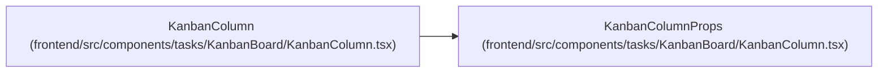

# KanbanColumnProps

**Location:** `frontend/src/components/tasks/KanbanBoard/KanbanColumn.tsx:13`
**Kind:** Class
**Bases:** —
**Module:** [KanbanColumn](../modules/KanbanColumn.md)

## Description

_Auto-generated from `KanbanColumnProps` in `frontend/src/components/tasks/KanbanBoard/KanbanColumn.tsx`._

## Attributes

| Name | Type | Default | Description |
|------|------|---------|-------------|
| `id` | `string` | *required* | — |
| `title` | `string` | *required* | — |
| `tasks` | `Task[]` | *required* | — |
| `count` | `number` | *required* | — |
| `tone` | `PillTone` | *required* | — |
| `onOpen` | `(task: Task, trigger?: HTMLElement) => void` | *required* | — |

## Methods

*No public methods. Inherits from base classes.*

## Relationships

<!-- Auto-generated relationship summary. Do not edit by hand. -->

### Summary

| Module | Methods | Attributes |
|---|---:|---|
| [KanbanColumn](../modules/KanbanColumn.md) | 0 | `count`, `id`, `onOpen`, `tasks`, `title`, `tone` |

### References

| Reference | Kind | Source | Call sites |
|---|---|---|---:|
| `KanbanColumn` | type_reference | [KanbanColumn](../modules/KanbanColumn.md) | — |
