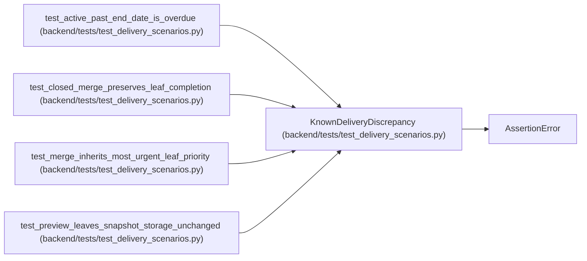

# KnownDeliveryDiscrepancy

**Location:** `backend/tests/test_delivery_scenarios.py:23`
**Kind:** Class
**Bases:** `AssertionError`
**Module:** [test_delivery_scenarios](../modules/test_delivery_scenarios.md)

## Description

Only the specific observed behavior may satisfy an expected failure.

## Attributes

*No annotated attributes found.*

## Methods

*No public methods. Inherits from base classes.*

## Relationships

<!-- Auto-generated relationship summary. Do not edit by hand. -->

### Summary

| Module | Methods | Attributes |
|---|---:|---|
| [test_delivery_scenarios](../modules/test_delivery_scenarios.md) | 0 | — |

### Structure

| Kind | Entity | Module |
|---|---|---|
| Base | `AssertionError` | — |

### References

| Reference | Kind | Source | Call sites |
|---|---|---|---:|
| `test_active_past_end_date_is_overdue` | call | [test_delivery_scenarios](../modules/test_delivery_scenarios.md) | 1 |
| `test_closed_merge_preserves_leaf_completion` | call | [test_delivery_scenarios](../modules/test_delivery_scenarios.md) | 1 |
| `test_merge_inherits_most_urgent_leaf_priority` | call | [test_delivery_scenarios](../modules/test_delivery_scenarios.md) | 1 |
| `test_preview_leaves_snapshot_storage_unchanged` | call | [test_delivery_scenarios](../modules/test_delivery_scenarios.md) | 1 |
