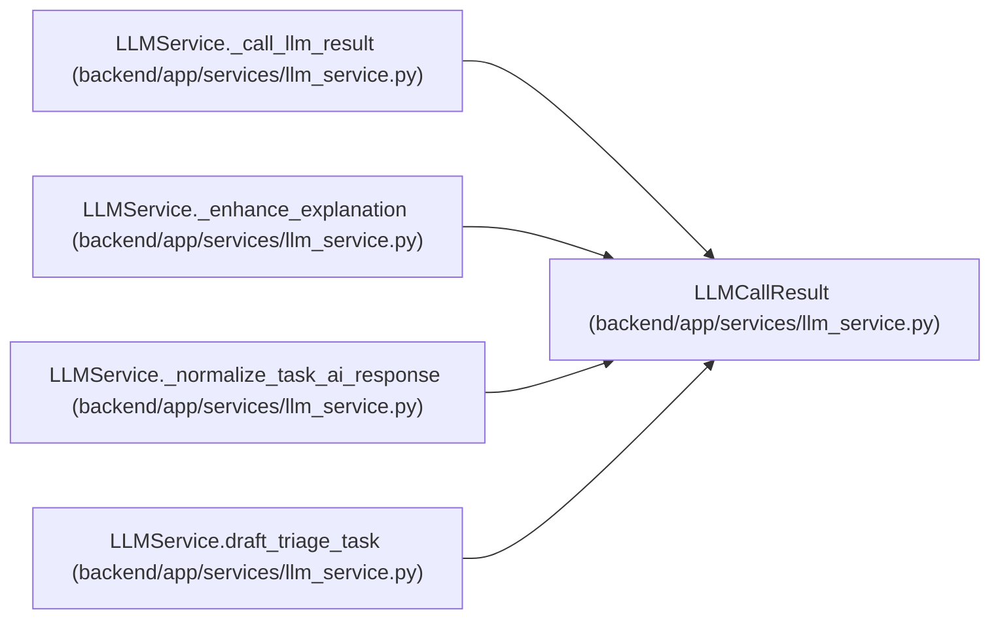

# LLMCallResult

**Location:** `backend/app/services/llm_service.py:42`
**Kind:** Class
**Bases:** —
**Module:** [llm_service](../modules/llm_service.md)

**Decorators:** `@dataclass(frozen=True)`

## Description

Normalized OpenAI-compatible chat completion result.

## Attributes

| Name | Type | Default | Description |
|------|------|---------|-------------|
| `content` | `str` | *required* | — |
| `finish_reason` | `Optional[str]` | `None` | — |

## Methods

| Method | Signature | Decorators | Description |
|--------|-----------|------------|-------------|
| `is_truncated` | `() -> bool` | `@property` | Whether the provider stopped because the token limit was reached. |

## Relationships

<!-- Auto-generated relationship summary. Do not edit by hand. -->

### Summary

| Module | Methods | Attributes |
|---|---:|---|
| [llm_service](../modules/llm_service.md) | 1 | `content`, `finish_reason` |

### References

| Reference | Kind | Source | Call sites |
|---|---|---|---:|
| `LLMService._call_llm_result` | call | [llm_service](../modules/llm_service.md) | 1 |
| `LLMService._call_llm_result` | type_reference | [llm_service](../modules/llm_service.md) | — |
| `LLMService._enhance_explanation` | call | [llm_service](../modules/llm_service.md) | 1 |
| `LLMService._enhance_explanation` | type_reference | [llm_service](../modules/llm_service.md) | — |
| `LLMService._normalize_task_ai_response` | type_reference | [llm_service](../modules/llm_service.md) | — |
| `LLMService.draft_triage_task` | call | [llm_service](../modules/llm_service.md) | 1 |
