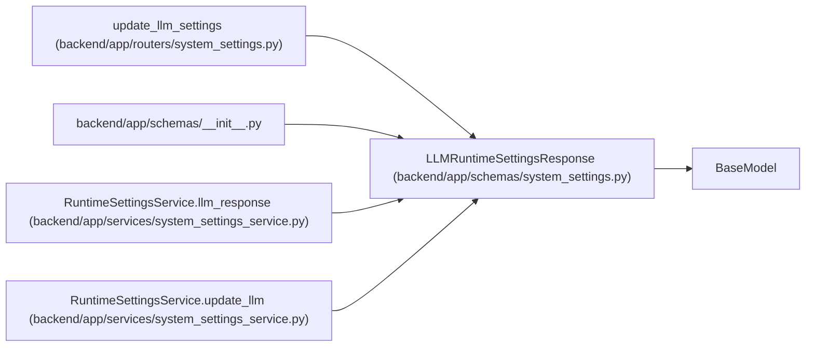

# LLMRuntimeSettingsResponse

**Location:** `backend/app/schemas/system_settings.py:25`
**Kind:** Pydantic model
**Bases:** `BaseModel`
**Module:** [schemas_system_settings](../modules/schemas_system_settings.md)

## Description

Resolved LLM runtime settings.

## Attributes

| Name | Type | Wire name | Required | Nullable | Default | Constraints | Examples | Description |
|------|------|-----------|----------|----------|---------|-------------|-------------|----------|
| `provider` | `LLMProvider` | `provider` | Yes | No | — | — | — | — |
| `api_url` | `str` | `api_url` | Yes | No | — | — | — | — |
| `model` | `str` | `model` | Yes | No | — | — | — | — |
| `temperature` | `float` | `temperature` | Yes | No | — | — | — | — |
| `max_output_tokens` | `int` | `max_output_tokens` | Yes | No | — | — | — | — |
| `has_api_key` | `bool` | `has_api_key` | Yes | No | — | — | — | — |
| `field_sources` | `dict[str, RuntimeSettingSource]` | `field_sources` | No | No | factory: `dict` | — | — | — |

## Methods

*No public methods. Inherits from base classes.*

## Relationships

<!-- Auto-generated relationship summary. Do not edit by hand. -->

### Summary

| Module | Methods | Attributes |
|---|---:|---|
| [schemas_system_settings](../modules/schemas_system_settings.md) | 0 | `api_url`, `field_sources`, `has_api_key`, `max_output_tokens`, `model`, `provider`, `temperature` |

### Structure

| Kind | Entity | Module |
|---|---|---|
| Base | `BaseModel` | — |

### References

| Reference | Kind | Source | Call sites |
|---|---|---|---:|
| `update_llm_settings` | type_reference | [routers_system_settings](../modules/routers_system_settings.md) | — |
| `__init__` | import | [schemas___init__](../modules/schemas___init__.md) | — |
| `RuntimeSettingsService.llm_response` | call | [system_settings_service](../modules/system_settings_service.md) | 1 |
| `RuntimeSettingsService.llm_response` | type_reference | [system_settings_service](../modules/system_settings_service.md) | — |
| `RuntimeSettingsService.update_llm` | type_reference | [system_settings_service](../modules/system_settings_service.md) | — |
