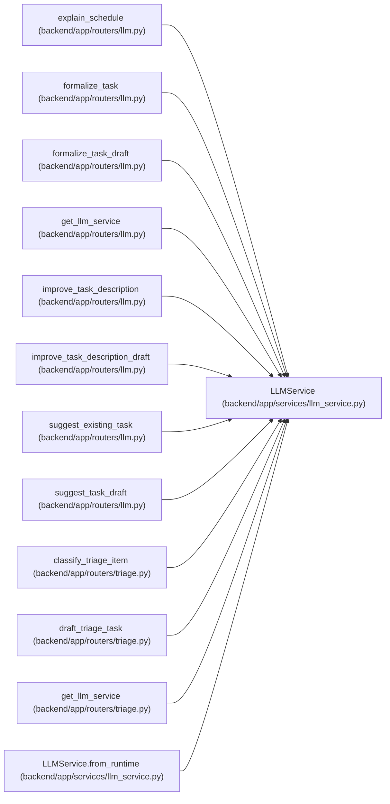

# LLMService

**Location:** `backend/app/services/llm_service.py:54`
**Kind:** Class
**Bases:** —
**Module:** [llm_service](../modules/llm_service.md)

## Description

Service for LLM-powered features.

## Attributes

*No annotated attributes found.*

## Methods

| Method | Signature | Decorators | Description |
|--------|-----------|------------|-------------|
| `__init__` | `(settings_override = None)` | — | — |
| `_resolve_language` | `(context: Any) -> LanguageCode` | — | Resolve AI prose language for the supplied source context. |
| `_language_instruction` | `(language: LanguageCode) -> str` | — | Return consistent provider instructions for localized AI prose. |
| `_t` | `(language: LanguageCode, en: str, ru: str) -> str` | — | Return a deterministic localized fallback string. |
| `from_runtime` | *(async)* `(db) -> 'LLMService'` | `@classmethod` | Construct an LLM service from DB-backed runtime settings. |
| `resolve_api_url` | `(provider: str = 'openai', api_url: str \| None = None) -> str` | `@classmethod` | Resolve the OpenAI-compatible chat completions URL for a provider. |
| `formalize_task` | *(async)* `(title: str, description: Optional[str] = None, context: Optional[str] = None) -> FormalizeResponse` | — | Formalize a task using LLM. |
| `_formalize_fallback` | `(title: str, description: Optional[str], language: LanguageCode) -> FormalizeResponse` | — | Fallback formalization without LLM. |
| `improve_description` | *(async)* `(current_description: str, context: Optional[str] = None) -> ImproveDescriptionResponse` | — | Improve task description using LLM. |
| `suggest_task` | *(async)* `(context_pack: dict[str, Any]) -> GroundedAISuggestionResponse` | — | Generate a grounded advisory task suggestion from a context pack. |
| `_task_ai_prompt` | `(context_pack: dict[str, Any], language: LanguageCode) -> str` | — | Build the JSON-only grounded task AI prompt. |
| `_task_ai_fallback` | `(context_pack: dict[str, Any], warning: str, language: LanguageCode) -> GroundedAISuggestionResponse` | — | Build a deterministic grounded task suggestion without provider output. |
| `_normalize_task_ai_response` | `(data: dict[str, Any], context_pack: dict[str, Any], result: LLMCallResult, language: LanguageCode) -> GroundedAISuggestionResponse` | — | Validate and normalize provider task AI output. |
| `_grounded_facts_from_context` | `(context_pack: dict[str, Any]) -> list[GroundedFact]` | — | Extract small source-labelled facts from the task context pack. |
| `_normalize_grounded_facts` | `(value: Any, context_pack: dict[str, Any]) -> list[GroundedFact]` | — | Normalize provider fact records and keep only known source labels. |
| `_task_context_source_text` | `(context_pack: dict[str, Any]) -> str` | — | Flatten context text for heuristic unsupported-claim checks. |
| `_demote_unsupported_task_claims` | `(description: str, source_text: str) -> tuple[str, list[str]]` | — | Move common hallucinated implementation details out of the description. |
| `classify_triage_item` | *(async)* `(triage_item: dict[str, Any], label_groups: list[dict[str, Any]], projects: list[dict[str, Any]], assignees: list[dict[str, Any]], duplicate_candidates: list[dict[str, Any]]) -> TriageClassificationDraft` | — | Classify a triage item into advisory structured suggestions. |
| `draft_triage_task` | *(async)* `(triage_item: dict[str, Any], template: Optional[dict[str, Any]] = None, classification: Optional[dict[str, Any]] = None, current_title: Optional[str] = None, current_description: Optional[str] = None) -> TriageTaskDraftResponse` | — | Draft transient task details for converting a triage item. |
| `_triage_task_draft_prompt` | `(triage_item: dict[str, Any], template: Optional[dict[str, Any]], classification: Optional[dict[str, Any]], current_title: Optional[str], current_description: Optional[str], language: LanguageCode) -> str` | — | Build the JSON-only triage task drafting prompt. |
| `_triage_task_draft_fallback` | `(triage_item: dict[str, Any], template: Optional[dict[str, Any]], classification: Optional[dict[str, Any]], current_title: Optional[str], current_description: Optional[str], rationale: str, language: LanguageCode) -> TriageTaskDraftResponse` | — | Build deterministic task draft suggestions without provider output. |
| `_triage_draft_grounded_facts` | `(triage_item: dict[str, Any], template: Optional[dict[str, Any]], current_title: Optional[str], current_description: Optional[str]) -> list[dict[str, str]]` | — | Return source-labelled facts for transient triage task drafts. |
| `_draft_title` | `(triage_item: dict[str, Any], template: Optional[dict[str, Any]], current_title: Optional[str], language: LanguageCode) -> str` | — | Choose a stable draft title from user input, template, or intake. |
| `_draft_description` | `(triage_item: dict[str, Any], template: Optional[dict[str, Any]], current_description: Optional[str], language: LanguageCode) -> str` | — | Build a deterministic task description from available context. |
| `_draft_checklist` | `(template: Optional[dict[str, Any]], language: LanguageCode) -> list[str]` | — | Return template checklist plus baseline conversion checks. |
| `_draft_acceptance_criteria` | `(triage_item: dict[str, Any], template: Optional[dict[str, Any]], classification: Optional[dict[str, Any]], language: LanguageCode) -> list[str]` | — | Generate stable acceptance criteria from intake/template hints. |
| `_draft_risks` | `(triage_item: dict[str, Any], classification: Optional[dict[str, Any]], language: LanguageCode) -> list[str]` | — | Generate stable risk notes from sparse intake data. |
| `_clean_text` | `(value: Any) -> Optional[str]` | — | Return stripped text or None. |
| `_clean_string_list` | `(value: Any) -> list[str]` | — | Normalize provider or template list fields into non-empty strings. |
| `_dedupe_ordered` | `(values: list[str]) -> list[str]` | — | Return strings in input order without duplicates. |
| `_triage_classification_prompt` | `(triage_item: dict[str, Any], label_groups: list[dict[str, Any]], projects: list[dict[str, Any]], assignees: list[dict[str, Any]], duplicate_candidates: list[dict[str, Any]], language: LanguageCode) -> str` | — | Build the JSON-only triage classification prompt. |
| `_parse_json_object` | `(value: str) -> dict[str, Any]` | — | Parse provider output that should contain a single JSON object. |
| `_triage_classification_fallback` | `(triage_item: dict[str, Any], label_groups: list[dict[str, Any]], projects: list[dict[str, Any]], assignees: list[dict[str, Any]], duplicate_candidates: list[dict[str, Any]], rationale: str, language: LanguageCode) -> TriageClassificationDraft` | — | Build deterministic triage classification without a provider. |
| `_normalized_triage_text` | `(triage_item: dict[str, Any]) -> str` | — | Combine triage text fields for fallback keyword matching. |
| `_first_existing_group_label` | `(existing_labels: list[str], group_labels: list[dict[str, Any]]) -> Optional[str]` | — | Return the first existing label that belongs to a label group. |
| `_keyword_label` | `(text: str, group_labels: list[dict[str, Any]], keyword_map: dict[str, list[str]]) -> Optional[str]` | — | Infer a label slug from keywords if that slug exists in the group. |
| `_fallback_priority` | `(triage_item: dict[str, Any], text: str) -> Optional[int]` | — | Infer priority from existing hints or severity keywords. |
| `_fallback_assignee` | `(triage_item: dict[str, Any], assignees: list[dict[str, Any]], text: str) -> tuple[Optional[int], Optional[str]]` | — | Resolve an assignee hint against candidate team members. |
| `_fallback_project` | `(triage_item: dict[str, Any], projects: list[dict[str, Any]], text: str) -> Optional[int]` | — | Resolve project hint or project name keyword. |
| `explain_schedule` | *(async)* `(decisions: list[SchedulingDecision], workload_issues: list[WorkloadIssue] \| None = None, detail_level: str = 'full') -> ExplainScheduleResponse` | — | Generate human-readable explanation for scheduling decisions. |
| `_schedule_explanation_fallback` | `(decisions: list[SchedulingDecision], workload_issues: list[WorkloadIssue], detail_level: str, language: LanguageCode) -> ExplainScheduleResponse` | — | Build a deterministic schedule explanation without an LLM provider. |
| `_schedule_recommendations` | `(scheduled: list[SchedulingDecision], delayed: list[SchedulingDecision], overdue: list[SchedulingDecision], reordered: list[SchedulingDecision], workload_issues: list[WorkloadIssue], language: LanguageCode) -> list[str]` | — | Derive stable recommendations from scheduler output. |
| `_enhance_explanation` | *(async)* `(decisions: list[SchedulingDecision], workload_issues: list[WorkloadIssue], language: LanguageCode) -> Optional[LLMCallResult]` | — | Use LLM to enhance schedule explanation. |
| `_call_llm` | *(async)* `(prompt: str) -> str` | — | Call LLM API. |
| `_call_llm_result` | *(async)* `(prompt: str) -> LLMCallResult` | — | Call LLM API and preserve OpenAI-compatible finish metadata. |

## Relationships

<!-- Auto-generated relationship summary. Do not edit by hand. -->

### Summary

| Module | Methods | Attributes |
|---|---:|---|
| [llm_service](../modules/llm_service.md) | 45 | — |

### References

| Reference | Kind | Source | Call sites |
|---|---|---|---:|
| `explain_schedule` | type_reference | [routers_llm](../modules/routers_llm.md) | — |
| `formalize_task` | type_reference | [routers_llm](../modules/routers_llm.md) | — |
| `formalize_task_draft` | type_reference | [routers_llm](../modules/routers_llm.md) | — |
| `get_llm_service` | type_reference | [routers_llm](../modules/routers_llm.md) | — |
| `improve_task_description` | type_reference | [routers_llm](../modules/routers_llm.md) | — |
| `improve_task_description_draft` | type_reference | [routers_llm](../modules/routers_llm.md) | — |
| `suggest_existing_task` | type_reference | [routers_llm](../modules/routers_llm.md) | — |
| `suggest_task_draft` | type_reference | [routers_llm](../modules/routers_llm.md) | — |
| `classify_triage_item` | type_reference | [routers_triage](../modules/routers_triage.md) | — |
| `draft_triage_task` | type_reference | [routers_triage](../modules/routers_triage.md) | — |
| `get_llm_service` | type_reference | [routers_triage](../modules/routers_triage.md) | — |
| `LLMService.from_runtime` | call | [llm_service](../modules/llm_service.md) | 1 |

> References: showing 12 of 15 logical references; 3 omitted by the 12-row generated summary limit.
