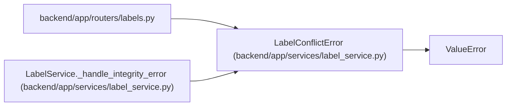

# LabelConflictError

**Location:** `backend/app/services/label_service.py:319`
**Kind:** Class
**Bases:** `ValueError`
**Module:** [label_service](../modules/label_service.md)

## Description

Raised when label taxonomy uniqueness constraints are violated.

## Attributes

*No annotated attributes found.*

## Methods

*No public methods. Inherits from base classes.*

## Relationships

<!-- Auto-generated relationship summary. Do not edit by hand. -->

### Summary

| Module | Methods | Attributes |
|---|---:|---|
| [label_service](../modules/label_service.md) | 0 | — |

### Structure

| Kind | Entity | Module |
|---|---|---|
| Base | `ValueError` | — |

### References

| Reference | Kind | Source | Call sites |
|---|---|---|---:|
| `labels` | import | [labels](../modules/labels.md) | — |
| `LabelService._handle_integrity_error` | call | [label_service](../modules/label_service.md) | 1 |
