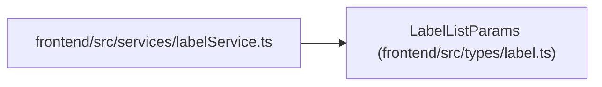

# LabelListParams

**Location:** `frontend/src/types/label.ts:65`
**Kind:** Class
**Bases:** —
**Module:** [types_label](../modules/types_label.md)

## Description

_Auto-generated from `LabelListParams` in `frontend/src/types/label.ts`._

## Attributes

| Name | Type | Default | Description |
|------|------|---------|-------------|
| `group_key` | `string` | *required* | — |
| `include_inactive` | `boolean` | *required* | — |
| `q` | `string` | *required* | — |

## Methods

*No public methods. Inherits from base classes.*

## Relationships

<!-- Auto-generated relationship summary. Do not edit by hand. -->

### Summary

| Module | Methods | Attributes |
|---|---:|---|
| [types_label](../modules/types_label.md) | 0 | `group_key`, `include_inactive`, `q` |

### References

| Reference | Kind | Source | Call sites |
|---|---|---|---:|
| `labelService` | import | [labelService](../modules/labelService.md) | — |
