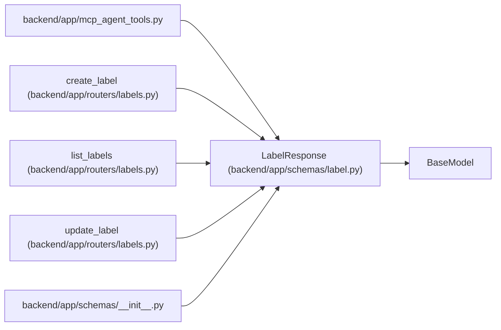

# LabelResponse

**Location:** `backend/app/schemas/label.py:74`
**Kind:** Pydantic model
**Bases:** `BaseModel`
**Module:** [schemas_label](../modules/schemas_label.md)

## Description

Schema for governed label responses.

## Model Configuration

| Setting | Value | Source |
|---------|-------|--------|
| `from_attributes` | `True` | model_config |

## Attributes

| Name | Type | Wire name | Required | Nullable | Default | Constraints | Examples | Description |
|------|------|-----------|----------|----------|---------|-------------|-------------|----------|
| `id` | `int` | `id` | Yes | No | — | — | — | — |
| `slug` | `str` | `slug` | Yes | No | — | — | — | — |
| `name` | `str` | `name` | Yes | No | — | — | — | — |
| `group_id` | `int` | `group_id` | Yes | No | — | — | — | — |
| `group` | `Optional[LabelGroupBrief]` | `group` | No | Yes | `None` | — | — | — |
| `description` | `Optional[str]` | `description` | No | Yes | `None` | — | — | — |
| `color` | `str` | `color` | Yes | No | — | — | — | — |
| `is_active` | `bool` | `is_active` | Yes | No | — | — | — | — |
| `sort_order` | `int` | `sort_order` | Yes | No | — | — | — | — |
| `seed_key` | `Optional[str]` | `seed_key` | No | Yes | `None` | — | — | — |
| `created_at` | `datetime` | `created_at` | Yes | No | — | — | — | — |
| `updated_at` | `datetime` | `updated_at` | Yes | No | — | — | — | — |

## Methods

*No public methods. Inherits from base classes.*

## Relationships

<!-- Auto-generated relationship summary. Do not edit by hand. -->

### Summary

| Module | Methods | Attributes |
|---|---:|---|
| [schemas_label](../modules/schemas_label.md) | 0 | `color`, `created_at`, `description`, `group`, `group_id`, `id`, `is_active`, `name`, `seed_key`, `slug`, `sort_order`, `updated_at` |

### Structure

| Kind | Entity | Module |
|---|---|---|
| Base | `BaseModel` | — |

### References

| Reference | Kind | Source | Call sites |
|---|---|---|---:|
| `mcp_agent_tools` | import | [mcp_agent_tools](../modules/mcp_agent_tools.md) | — |
| `create_label` | type_reference | [labels](../modules/labels.md) | — |
| `list_labels` | type_reference | [labels](../modules/labels.md) | — |
| `update_label` | type_reference | [labels](../modules/labels.md) | — |
| `__init__` | import | [schemas___init__](../modules/schemas___init__.md) | — |
