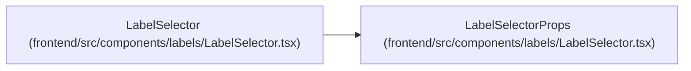

# LabelSelectorProps

**Location:** `frontend/src/components/labels/LabelSelector.tsx:11`
**Kind:** Class
**Bases:** —
**Module:** [LabelSelector](../modules/LabelSelector.md)

## Description

_Auto-generated from `LabelSelectorProps` in `frontend/src/components/labels/LabelSelector.tsx`._

## Attributes

| Name | Type | Required | Default | Description |
|------|------|----------|---------|-------------|
| `value` | `string[]` | Yes | — | — |
| `onChange` | `(labels: string[]) => void` | Yes | — | — |
| `label` | `string` | No | — | — |
| `placeholder` | `string` | No | — | — |
| `allowCustom` | `boolean` | No | — | — |
| `className` | `string` | No | — | — |

## Methods

*No public methods. Inherits from base classes.*

## Relationships

<!-- Auto-generated relationship summary. Do not edit by hand. -->

### Summary

| Module | Methods | Attributes |
|---|---:|---|
| [LabelSelector](../modules/LabelSelector.md) | 0 | `allowCustom`, `className`, `label`, `onChange`, `placeholder`, `value` |

### References

| Reference | Kind | Source | Call sites |
|---|---|---|---:|
| `LabelSelector` | type_reference | [LabelSelector](../modules/LabelSelector.md) | — |
