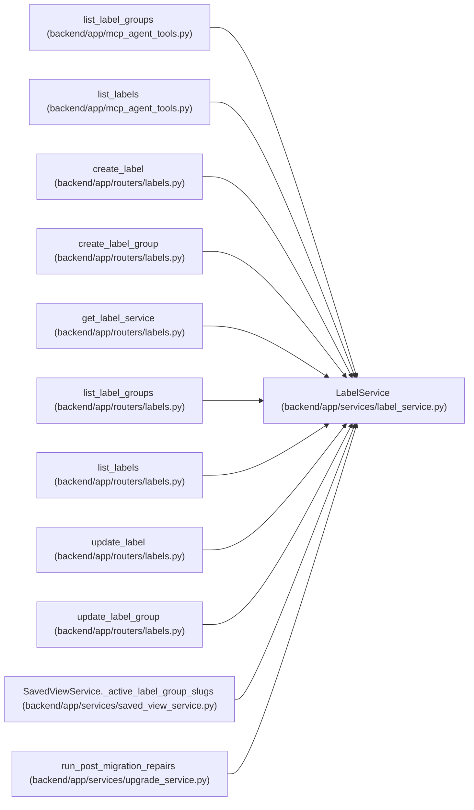

# LabelService

**Location:** `backend/app/services/label_service.py:110`
**Kind:** Class
**Bases:** —
**Module:** [label_service](../modules/label_service.md)

## Description

Service for label group and label CRUD plus built-in label seeding.

## Attributes

*No annotated attributes found.*

## Methods

| Method | Signature | Decorators | Description |
|--------|-----------|------------|-------------|
| `__init__` | `(db: AsyncSession)` | — | — |
| `_handle_integrity_error` | *(async)* `(message: str, exc: IntegrityError)` | — | Rollback failed writes and expose a stable conflict message. |
| `_group_query` | `() -> Select` | — | Build the base group query. |
| `_label_query` | `() -> Select` | — | Build the base label query. |
| `seed_default_labels` | *(async)* `() -> list[LabelGroup \| Label]` | — | Insert missing built-in label groups and labels without overwriting edits. |
| `list_groups` | *(async)* `(include_inactive: bool = False) -> Sequence[LabelGroup]` | — | List label groups ordered for filter UI display. |
| `list_labels` | *(async)* `(group_key: Optional[str] = None, include_inactive: bool = False, q: Optional[str] = None) -> Sequence[Label]` | — | List governed labels with optional group and text filters. |
| `get_group_by_id` | *(async)* `(group_id: int) -> Optional[LabelGroup]` | — | Get a label group by ID. |
| `get_label_by_id` | *(async)* `(label_id: int) -> Optional[Label]` | — | Get a label by ID. |
| `create_group` | *(async)* `(data: LabelGroupCreate) -> LabelGroup` | — | Create a user-managed label group. |
| `update_group` | *(async)* `(group_id: int, data: LabelGroupUpdate) -> Optional[LabelGroup]` | — | Apply a partial label group update. |
| `create_label` | *(async)* `(data: LabelCreate) -> Label` | — | Create a user-managed label. |
| `update_label` | *(async)* `(label_id: int, data: LabelUpdate) -> Optional[Label]` | — | Apply a partial label update. |

## Relationships

<!-- Auto-generated relationship summary. Do not edit by hand. -->

### Summary

| Module | Methods | Attributes |
|---|---:|---|
| [label_service](../modules/label_service.md) | 13 | — |

### References

| Reference | Kind | Source | Call sites |
|---|---|---|---:|
| `list_label_groups` | call | [mcp_agent_tools](../modules/mcp_agent_tools.md) | 1 |
| `list_labels` | call | [mcp_agent_tools](../modules/mcp_agent_tools.md) | 1 |
| `create_label` | type_reference | [labels](../modules/labels.md) | — |
| `create_label_group` | type_reference | [labels](../modules/labels.md) | — |
| `get_label_service` | call | [labels](../modules/labels.md) | 1 |
| `get_label_service` | type_reference | [labels](../modules/labels.md) | — |
| `list_label_groups` | type_reference | [labels](../modules/labels.md) | — |
| `list_labels` | type_reference | [labels](../modules/labels.md) | — |
| `update_label` | type_reference | [labels](../modules/labels.md) | — |
| `update_label_group` | type_reference | [labels](../modules/labels.md) | — |
| `SavedViewService._active_label_group_slugs` | call | [saved_view_service](../modules/saved_view_service.md) | 1 |
| `run_post_migration_repairs` | call | [upgrade_service](../modules/upgrade_service.md) | 1 |
