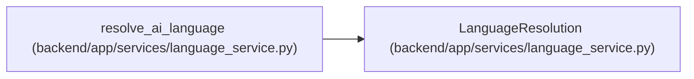

# LanguageResolution

**Location:** `backend/app/services/language_service.py:25`
**Kind:** Class
**Bases:** —
**Module:** [language_service](../modules/language_service.md)

**Decorators:** `@dataclass(frozen=True)`

## Description

Resolved language selection and the reason it was chosen.

## Attributes

| Name | Type | Default | Description |
|------|------|---------|-------------|
| `language` | `LanguageCode` | *required* | — |
| `mode` | `AILanguageMode` | *required* | — |
| `source` | `Literal['forced', 'detected', 'fallback']` | *required* | — |

## Methods

*No public methods. Inherits from base classes.*

## Relationships

<!-- Auto-generated relationship summary. Do not edit by hand. -->

### Summary

| Module | Methods | Attributes |
|---|---:|---|
| [language_service](../modules/language_service.md) | 0 | `language`, `mode`, `source` |

### References

| Reference | Kind | Source | Call sites |
|---|---|---|---:|
| `resolve_ai_language` | call | [language_service](../modules/language_service.md) | 3 |
| `resolve_ai_language` | type_reference | [language_service](../modules/language_service.md) | — |
