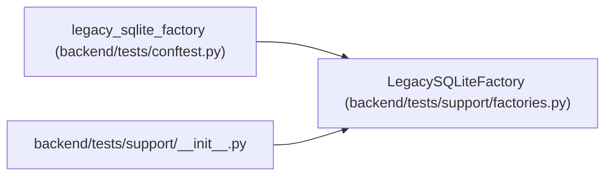

# LegacySQLiteFactory

**Location:** `backend/tests/support/factories.py:80`
**Kind:** Class
**Bases:** —
**Module:** [factories](../modules/factories.md)

## Description

Create representative pre-Alembic SQLite sources for migration tests.

## Attributes

*No annotated attributes found.*

## Methods

| Method | Signature | Decorators | Description |
|--------|-----------|------------|-------------|
| `create` | `(path: Path, *, with_orphan: bool = False) -> Path` | — | Create a valid source, or one deliberately containing an orphan. |

## Relationships

<!-- Auto-generated relationship summary. Do not edit by hand. -->

### Summary

| Module | Methods | Attributes |
|---|---:|---|
| [factories](../modules/factories.md) | 1 | — |

### References

| Reference | Kind | Source | Call sites |
|---|---|---|---:|
| `legacy_sqlite_factory` | call | [conftest](../modules/conftest.md) | 1 |
| `__init__` | import | [support___init__](../modules/support___init__.md) | — |
