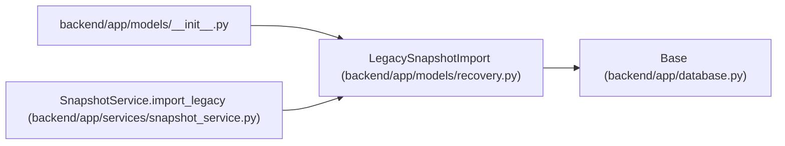

# LegacySnapshotImport

**Location:** `backend/app/models/recovery.py:30`
**Kind:** Class
**Bases:** `Base`
**Module:** [recovery](../modules/recovery.md)

## Description

_Auto-generated from `LegacySnapshotImport` in `backend/app/models/recovery.py`._

## Attributes

| Name | Type | Default | Description |
|------|------|---------|-------------|
| `checksum` | `Mapped[str]` | `mapped_column(String(64), primary_key=True)` | — |
| `iteration_id` | `Mapped[int]` | `mapped_column(ForeignKey('iterations.id', ondelete='CASCADE'), index=True)` | — |
| `source_name` | `Mapped[str]` | `mapped_column(String(255), nullable=False)` | — |
| `disposition` | `Mapped[str]` | `mapped_column(String(32), nullable=False)` | — |
| `reason` | `Mapped[str]` | `mapped_column(Text, nullable=False)` | — |
| `imported_at` | `Mapped[datetime]` | `mapped_column(UTCDateTime(), default=utc_now)` | — |

## Methods

*No public methods. Inherits from base classes.*

## Relationships

<!-- Auto-generated relationship summary. Do not edit by hand. -->

### Summary

| Module | Methods | Attributes |
|---|---:|---|
| [recovery](../modules/recovery.md) | 0 | `checksum`, `disposition`, `imported_at`, `iteration_id`, `reason`, `source_name` |

### Structure

| Kind | Entity | Module |
|---|---|---|
| Base | `Base` | [app_database](../modules/app_database.md) |

### References

| Reference | Kind | Source | Call sites |
|---|---|---|---:|
| `__init__` | import | [models___init__](../modules/models___init__.md) | — |
| `SnapshotService.import_legacy` | call | [snapshot_service](../modules/snapshot_service.md) | 1 |
