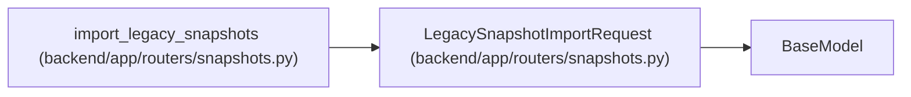

# LegacySnapshotImportRequest

**Location:** `backend/app/routers/snapshots.py:269`
**Kind:** Pydantic model
**Bases:** `BaseModel`
**Module:** [snapshots](../modules/snapshots.md)

## Description

_Auto-generated from `LegacySnapshotImportRequest` in `backend/app/routers/snapshots.py`._

## Attributes

| Name | Type | Wire name | Required | Nullable | Default | Constraints | Examples | Description |
|------|------|-----------|----------|----------|---------|-------------|-------------|----------|
| `dry_run` | `bool` | `dry_run` | No | No | `True` | — | — | — |
| `limit` | `int` | `limit` | No | No | `25` | ge=1; le=100 | — | — |

## Methods

*No public methods. Inherits from base classes.*

## Relationships

<!-- Auto-generated relationship summary. Do not edit by hand. -->

### Summary

| Module | Methods | Attributes |
|---|---:|---|
| [snapshots](../modules/snapshots.md) | 0 | `dry_run`, `limit` |

### Structure

| Kind | Entity | Module |
|---|---|---|
| Base | `BaseModel` | — |

### References

| Reference | Kind | Source | Call sites |
|---|---|---|---:|
| `import_legacy_snapshots` | type_reference | [snapshots](../modules/snapshots.md) | — |
