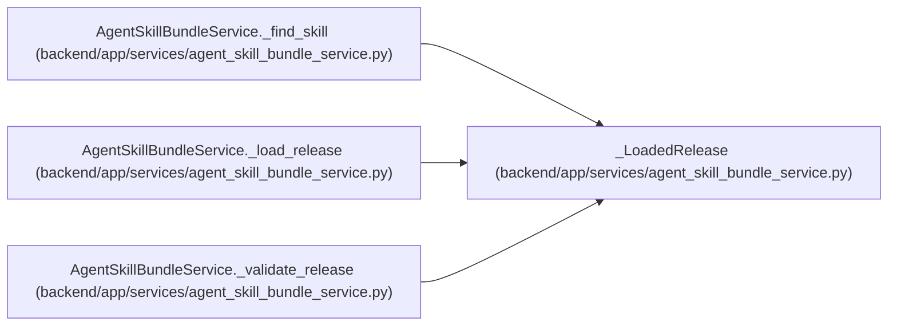

# _LoadedRelease

**Location:** `backend/app/services/agent_skill_bundle_service.py:81`
**Kind:** Class
**Bases:** —
**Module:** [agent_skill_bundle_service](../modules/agent_skill_bundle_service.md)

**Decorators:** `@dataclass(frozen=True)`

## Description

_Auto-generated from `_LoadedRelease` in `backend/app/services/agent_skill_bundle_service.py`._

## Attributes

| Name | Type | Default | Description |
|------|------|---------|-------------|
| `catalog` | `SkillBundleCatalogResponse` | *required* | — |
| `catalog_bytes` | `bytes` | *required* | — |
| `skills` | `dict[tuple[str, str], SkillBundleCatalogEntry]` | *required* | — |
| `artifact_bytes` | `dict[str, bytes]` | *required* | — |

## Methods

*No public methods. Inherits from base classes.*

## Relationships

<!-- Auto-generated relationship summary. Do not edit by hand. -->

### Summary

| Module | Methods | Attributes |
|---|---:|---|
| [agent_skill_bundle_service](../modules/agent_skill_bundle_service.md) | 0 | `artifact_bytes`, `catalog`, `catalog_bytes`, `skills` |

### References

| Reference | Kind | Source | Call sites |
|---|---|---|---:|
| `AgentSkillBundleService._find_skill` | type_reference | [agent_skill_bundle_service](../modules/agent_skill_bundle_service.md) | — |
| `AgentSkillBundleService._load_release` | type_reference | [agent_skill_bundle_service](../modules/agent_skill_bundle_service.md) | — |
| `AgentSkillBundleService._validate_release` | call | [agent_skill_bundle_service](../modules/agent_skill_bundle_service.md) | 1 |
| `AgentSkillBundleService._validate_release` | type_reference | [agent_skill_bundle_service](../modules/agent_skill_bundle_service.md) | — |
