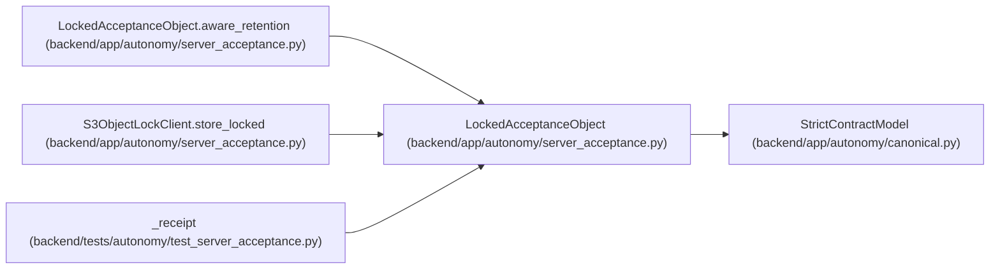

# LockedAcceptanceObject

**Location:** `backend/app/autonomy/server_acceptance.py:172`
**Kind:** Pydantic model
**Bases:** `StrictContractModel`
**Module:** [autonomy_server_acceptance](../modules/autonomy_server_acceptance.md)

## Description

_Auto-generated from `LockedAcceptanceObject` in `backend/app/autonomy/server_acceptance.py`._

## Validators

| Method | Scope | Fields | Mode | Options |
|--------|-------|--------|------|---------|
| `aware_retention` | model | — | after | — |

## Attributes

| Name | Type | Wire name | Required | Nullable | Default | Constraints | Examples | Description |
|------|------|-----------|----------|----------|---------|-------------|-------------|----------|
| `implementation` | `Literal['minio-s3-object-lock']` | `implementation` | No | No | `'minio-s3-object-lock'` | — | — | — |
| `bucket` | `str` | `bucket` | Yes | No | — | pattern='^[a-z0-9][a-z0-9.-]{1,62}$' | — | — |
| `object_key` | `str` | `object_key` | Yes | No | — | max_length=1024; min_length=1 | — | — |
| `version_id` | `str` | `version_id` | Yes | No | — | max_length=1024; min_length=1 | — | — |
| `object_sha256` | `str` | `object_sha256` | Yes | No | — | pattern=unknown (SHA256_PATTERN) | — | — |
| `lock_mode` | `Literal['COMPLIANCE']` | `lock_mode` | Yes | No | — | — | — | — |
| `retain_until` | `datetime` | `retain_until` | Yes | No | — | — | — | — |
| `delete_response_status` | `int` | `delete_response_status` | Yes | No | — | ge=200; le=499 | — | — |
| `exact_bytes_verified` | `Literal[True]` | `exact_bytes_verified` | No | No | `True` | — | — | — |
| `exact_version_delete_blocked` | `Literal[True]` | `exact_version_delete_blocked` | No | No | `True` | — | — | — |

## Methods

| Method | Signature | Decorators | Description |
|--------|-----------|------------|-------------|
| `aware_retention` | `() -> 'LockedAcceptanceObject'` | `@model_validator(mode='after')` | — |

## Relationships

<!-- Auto-generated relationship summary. Do not edit by hand. -->

### Summary

| Module | Methods | Attributes |
|---|---:|---|
| [autonomy_server_acceptance](../modules/autonomy_server_acceptance.md) | 1 | `bucket`, `delete_response_status`, `exact_bytes_verified`, `exact_version_delete_blocked`, `implementation`, `lock_mode`, `object_key`, `object_sha256`, `retain_until`, `version_id` |

### Structure

| Kind | Entity | Module |
|---|---|---|
| Base | `StrictContractModel` | [autonomy_canonical](../modules/autonomy_canonical.md) |

### References

| Reference | Kind | Source | Call sites |
|---|---|---|---:|
| `LockedAcceptanceObject.aware_retention` | type_reference | [autonomy_server_acceptance](../modules/autonomy_server_acceptance.md) | — |
| `S3ObjectLockClient.store_locked` | call | [autonomy_server_acceptance](../modules/autonomy_server_acceptance.md) | 1 |
| `S3ObjectLockClient.store_locked` | type_reference | [autonomy_server_acceptance](../modules/autonomy_server_acceptance.md) | — |
| `_receipt` | call | [test_server_acceptance](../modules/test_server_acceptance.md) | 1 |
