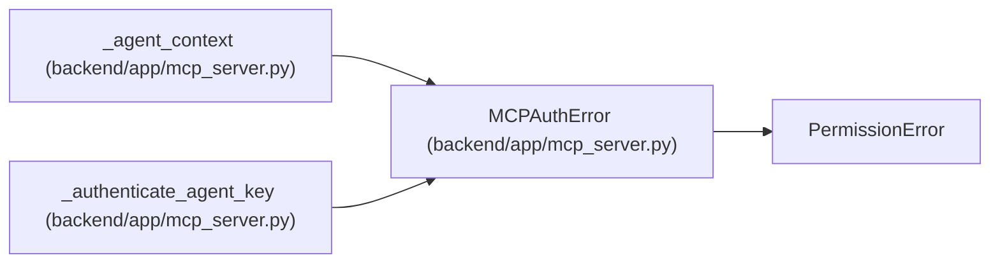

# MCPAuthError

**Location:** `backend/app/mcp_server.py:43`
**Kind:** Class
**Bases:** `PermissionError`
**Module:** [mcp_server](../modules/mcp_server.md)

## Description

Raised when MCP agent authentication fails.

## Attributes

*No annotated attributes found.*

## Methods

*No public methods. Inherits from base classes.*

## Relationships

<!-- Auto-generated relationship summary. Do not edit by hand. -->

### Summary

| Module | Methods | Attributes |
|---|---:|---|
| [mcp_server](../modules/mcp_server.md) | 0 | — |

### Structure

| Kind | Entity | Module |
|---|---|---|
| Base | `PermissionError` | — |

### References

| Reference | Kind | Source | Call sites |
|---|---|---|---:|
| `_agent_context` | call | [mcp_server](../modules/mcp_server.md) | 1 |
| `_authenticate_agent_key` | call | [mcp_server](../modules/mcp_server.md) | 3 |
