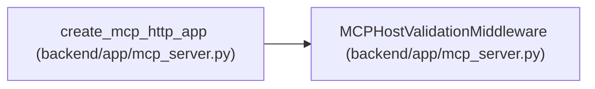

# MCPHostValidationMiddleware

**Location:** `backend/app/mcp_server.py:66`
**Kind:** Class
**Bases:** —
**Module:** [mcp_server](../modules/mcp_server.md)

## Description

Reject untrusted MCP Host/Origin values before database authentication.

## Attributes

*No annotated attributes found.*

## Methods

| Method | Signature | Decorators | Description |
|--------|-----------|------------|-------------|
| `__init__` | `(app: ASGIApp)` | — | — |
| `__call__` | *(async)* `(scope: Scope, receive: Receive, send: Send) -> None` | — | — |

## Relationships

<!-- Auto-generated relationship summary. Do not edit by hand. -->

### Summary

| Module | Methods | Attributes |
|---|---:|---|
| [mcp_server](../modules/mcp_server.md) | 2 | — |

### References

| Reference | Kind | Source | Call sites |
|---|---|---|---:|
| `create_mcp_http_app` | call | [mcp_server](../modules/mcp_server.md) | 1 |
