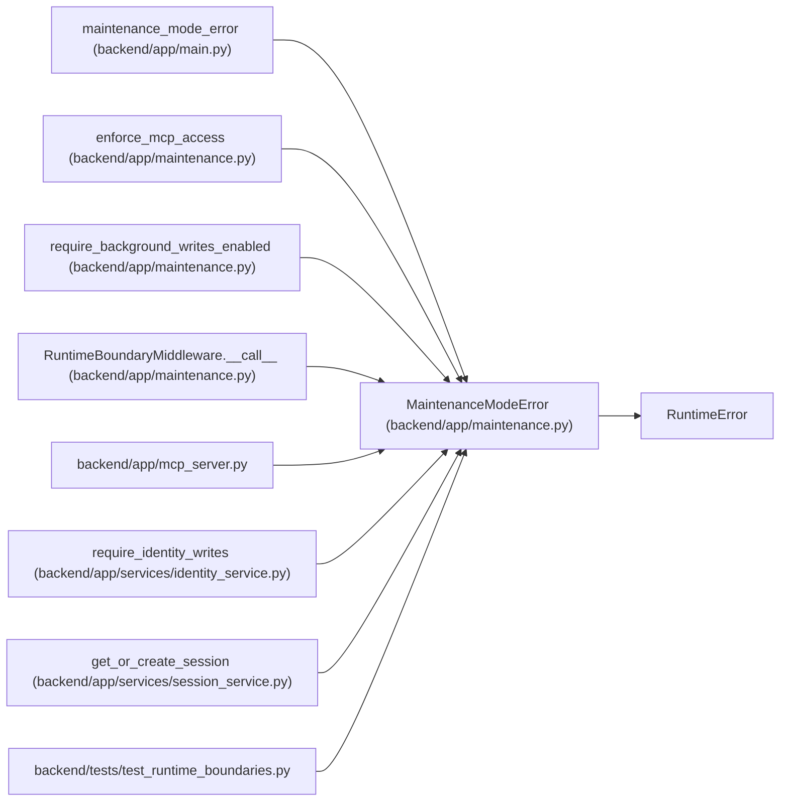

# MaintenanceModeError

**Location:** `backend/app/maintenance.py:25`
**Kind:** Class
**Bases:** `RuntimeError`
**Module:** [maintenance](../modules/maintenance.md)

## Description

A write or non-allowlisted validation read was fenced.

## Attributes

*No annotated attributes found.*

## Methods

| Method | Signature | Decorators | Description |
|--------|-----------|------------|-------------|
| `__init__` | `(*, operation: str, mode: str)` | — | — |
| `detail` | `() -> dict[str, Any]` | — | — |

## Relationships

<!-- Auto-generated relationship summary. Do not edit by hand. -->

### Summary

| Module | Methods | Attributes |
|---|---:|---|
| [maintenance](../modules/maintenance.md) | 2 | — |

### Structure

| Kind | Entity | Module |
|---|---|---|
| Base | `RuntimeError` | — |

### References

| Reference | Kind | Source | Call sites |
|---|---|---|---:|
| `maintenance_mode_error` | type_reference | [app_main](../modules/app_main.md) | — |
| `enforce_mcp_access` | call | [maintenance](../modules/maintenance.md) | 1 |
| `require_background_writes_enabled` | call | [maintenance](../modules/maintenance.md) | 1 |
| `RuntimeBoundaryMiddleware.__call__` | call | [maintenance](../modules/maintenance.md) | 1 |
| `mcp_server` | import | [mcp_server](../modules/mcp_server.md) | — |
| `require_identity_writes` | call | [identity_service](../modules/identity_service.md) | 1 |
| `get_or_create_session` | call | [session_service](../modules/session_service.md) | 1 |
| `test_runtime_boundaries` | import | [test_runtime_boundaries](../modules/test_runtime_boundaries.md) | — |
