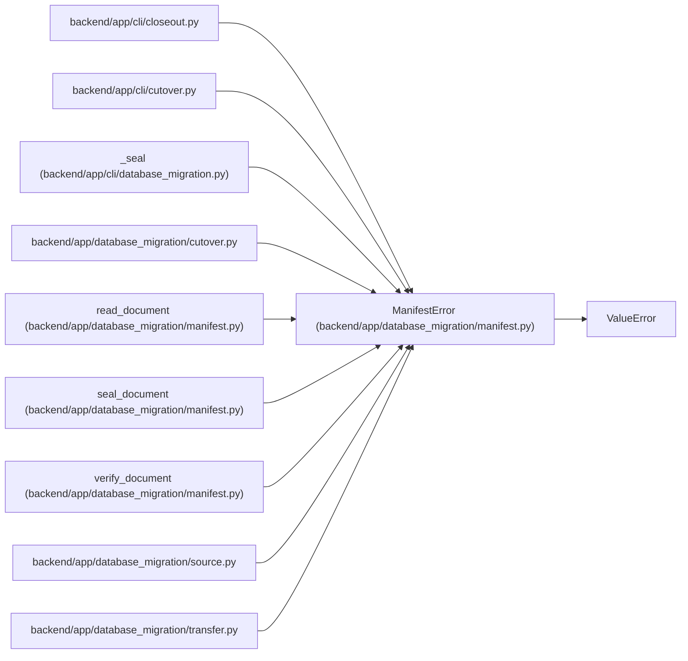

# ManifestError

**Location:** `backend/app/database_migration/manifest.py:15`
**Kind:** Class
**Bases:** `ValueError`
**Module:** [database_migration_manifest](../modules/database_migration_manifest.md)

## Description

A migration document is malformed or has lost integrity.

## Attributes

*No annotated attributes found.*

## Methods

*No public methods. Inherits from base classes.*

## Relationships

<!-- Auto-generated relationship summary. Do not edit by hand. -->

### Summary

| Module | Methods | Attributes |
|---|---:|---|
| [database_migration_manifest](../modules/database_migration_manifest.md) | 0 | — |

### Structure

| Kind | Entity | Module |
|---|---|---|
| Base | `ValueError` | — |

### References

| Reference | Kind | Source | Call sites |
|---|---|---|---:|
| `closeout` | import | [cli_closeout](../modules/cli_closeout.md) | — |
| `cutover` | import | [cli_cutover](../modules/cli_cutover.md) | — |
| `_seal` | call | [cli_database_migration](../modules/cli_database_migration.md) | 3 |
| `cutover` | import | [database_migration_cutover](../modules/database_migration_cutover.md) | — |
| `read_document` | call | [database_migration_manifest](../modules/database_migration_manifest.md) | 2 |
| `seal_document` | call | [database_migration_manifest](../modules/database_migration_manifest.md) | 1 |
| `verify_document` | call | [database_migration_manifest](../modules/database_migration_manifest.md) | 2 |
| `source` | import | [source](../modules/source.md) | — |
| `transfer` | import | [transfer](../modules/transfer.md) | — |
