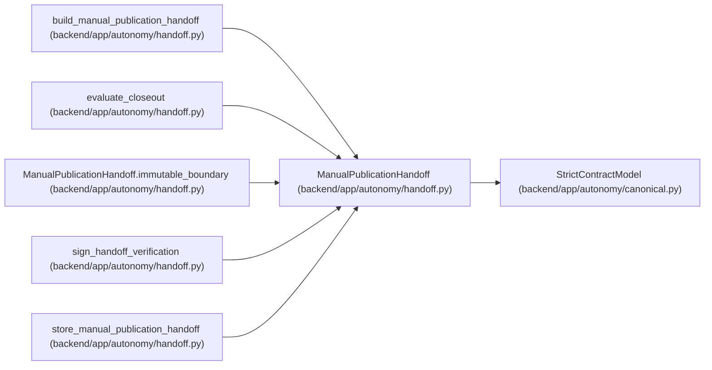

# ManualPublicationHandoff

**Location:** `backend/app/autonomy/handoff.py:85`
**Kind:** Pydantic model
**Bases:** `StrictContractModel`
**Module:** [handoff](../modules/handoff.md)

## Description

Exact immutable bytes made available to a separate manual process.

## Validators

| Method | Scope | Fields | Mode | Options |
|--------|-------|--------|------|---------|
| `immutable_boundary` | model | — | after | — |

## Attributes

| Name | Type | Wire name | Required | Nullable | Default | Constraints | Examples | Description |
|------|------|-----------|----------|----------|---------|-------------|-------------|----------|
| `schema_version` | `Literal['manual-publication-handoff-v1']` | `schema_version` | No | No | `'manual-publication-handoff-v1'` | — | — | — |
| `publication_state` | `Literal['NOT-PUBLISHED']` | `publication_state` | No | No | `'NOT-PUBLISHED'` | — | — | — |
| `publication_requirement` | `Literal['MANUAL-PUBLICATION-REQUIRED']` | `publication_requirement` | No | No | `'MANUAL-PUBLICATION-REQUIRED'` | — | — | — |
| `release_fingerprint` | `str` | `release_fingerprint` | Yes | No | — | pattern=unknown (SHA256_PATTERN) | — | — |
| `charter_digest` | `str` | `charter_digest` | Yes | No | — | pattern=unknown (SHA256_PATTERN) | — | — |
| `contract_manifest_digest` | `str` | `contract_manifest_digest` | Yes | No | — | pattern=unknown (SHA256_PATTERN) | — | — |
| `production_record_digest` | `str` | `production_record_digest` | Yes | No | — | pattern=unknown (SHA256_PATTERN) | — | — |
| `built_at` | `datetime` | `built_at` | Yes | No | — | — | — | — |
| `valid_until` | `datetime` | `valid_until` | Yes | No | — | — | — | — |
| `availability_state` | `AvailabilityState` | `availability_state` | Yes | No | — | — | — | — |
| `retention_state` | `RetentionState` | `retention_state` | Yes | No | — | — | — | — |
| `availability_observation_ends_at` | `datetime` | `availability_observation_ends_at` | Yes | No | — | — | — | — |
| `retention_due_at` | `datetime` | `retention_due_at` | Yes | No | — | — | — | — |
| `capacity_boundary` | `CapacityClaimBoundary` | `capacity_boundary` | Yes | No | — | — | — | — |
| `availability_claim_allowed` | `bool` | `availability_claim_allowed` | Yes | No | — | — | — | — |
| `candidate_notes` | `str` | `candidate_notes` | Yes | No | — | min_length=1; max_length=100000 | — | — |
| `candidate_notes_sha256` | `str` | `candidate_notes_sha256` | Yes | No | — | pattern=unknown (SHA256_PATTERN) | — | — |
| `evidence` | `tuple[HandoffEvidenceReference, ...]` | `evidence` | Yes | No | — | min_length=1; max_length=512 | — | — |
| `handoff_digest` | `str` | `handoff_digest` | Yes | No | — | pattern=unknown (SHA256_PATTERN) | — | — |

## Methods

| Method | Signature | Decorators | Description |
|--------|-----------|------------|-------------|
| `immutable_boundary` | `() -> 'ManualPublicationHandoff'` | `@model_validator(mode='after')` | — |

## Relationships

<!-- Auto-generated relationship summary. Do not edit by hand. -->

### Summary

| Module | Methods | Attributes |
|---|---:|---|
| [handoff](../modules/handoff.md) | 1 | `availability_claim_allowed`, `availability_observation_ends_at`, `availability_state`, `built_at`, `candidate_notes`, `candidate_notes_sha256`, `capacity_boundary`, `charter_digest`, `contract_manifest_digest`, `evidence`, `handoff_digest`, `production_record_digest` |

### Structure

| Kind | Entity | Module |
|---|---|---|
| Base | `StrictContractModel` | [autonomy_canonical](../modules/autonomy_canonical.md) |

### References

| Reference | Kind | Source | Call sites |
|---|---|---|---:|
| `build_manual_publication_handoff` | call | [handoff](../modules/handoff.md) | 1 |
| `build_manual_publication_handoff` | type_reference | [handoff](../modules/handoff.md) | — |
| `evaluate_closeout` | type_reference | [handoff](../modules/handoff.md) | — |
| `ManualPublicationHandoff.immutable_boundary` | type_reference | [handoff](../modules/handoff.md) | — |
| `sign_handoff_verification` | type_reference | [handoff](../modules/handoff.md) | — |
| `store_manual_publication_handoff` | type_reference | [handoff](../modules/handoff.md) | — |
