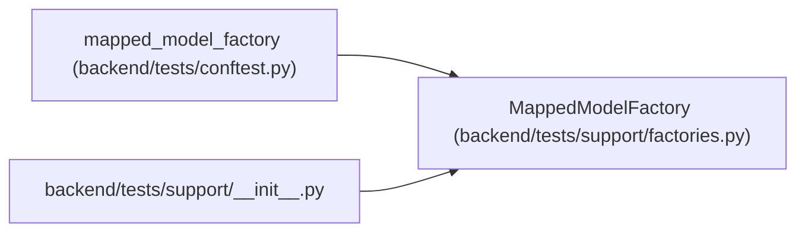

# MappedModelFactory

**Location:** `backend/tests/support/factories.py:16`
**Kind:** Class
**Bases:** —
**Module:** [factories](../modules/factories.md)

## Description

Build any registered SQLAlchemy model with deterministic safe values.

The generic builder is intentionally model-agnostic so newly mapped tables
become visible to one coverage test. Callers provide relationship-specific
overrides when they intend to flush a graph.

## Attributes

*No annotated attributes found.*

## Methods

| Method | Signature | Decorators | Description |
|--------|-----------|------------|-------------|
| `__init__` | `() -> None` | — | — |
| `_next` | `() -> int` | — | — |
| `_value_for` | `(column: Any) -> Any` | — | — |
| `build` | `(model: type[Any], /, **overrides: Any) -> Any` | — | Build, but do not persist, one instance of any mapped model. |

## Relationships

<!-- Auto-generated relationship summary. Do not edit by hand. -->

### Summary

| Module | Methods | Attributes |
|---|---:|---|
| [factories](../modules/factories.md) | 4 | — |

### References

| Reference | Kind | Source | Call sites |
|---|---|---|---:|
| `mapped_model_factory` | call | [conftest](../modules/conftest.md) | 1 |
| `__init__` | import | [support___init__](../modules/support___init__.md) | — |
