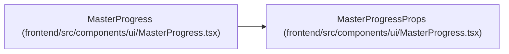

# MasterProgressProps

**Location:** `frontend/src/components/ui/MasterProgress.tsx:1`
**Kind:** Class
**Bases:** —
**Module:** [MasterProgress](../modules/MasterProgress.md)

## Description

_Auto-generated from `MasterProgressProps` in `frontend/src/components/ui/MasterProgress.tsx`._

## Attributes

| Name | Type | Default | Description |
|------|------|---------|-------------|
| `className` | `string` | *required* | — |
| `completed` | `number` | *required* | — |
| `label` | `string` | *required* | — |
| `total` | `number` | *required* | — |
| `valueText` | `string` | *required* | — |

## Methods

*No public methods. Inherits from base classes.*

## Relationships

<!-- Auto-generated relationship summary. Do not edit by hand. -->

### Summary

| Module | Methods | Attributes |
|---|---:|---|
| [MasterProgress](../modules/MasterProgress.md) | 0 | `className`, `completed`, `label`, `total`, `valueText` |

### References

| Reference | Kind | Source | Call sites |
|---|---|---|---:|
| `MasterProgress` | type_reference | [MasterProgress](../modules/MasterProgress.md) | — |
