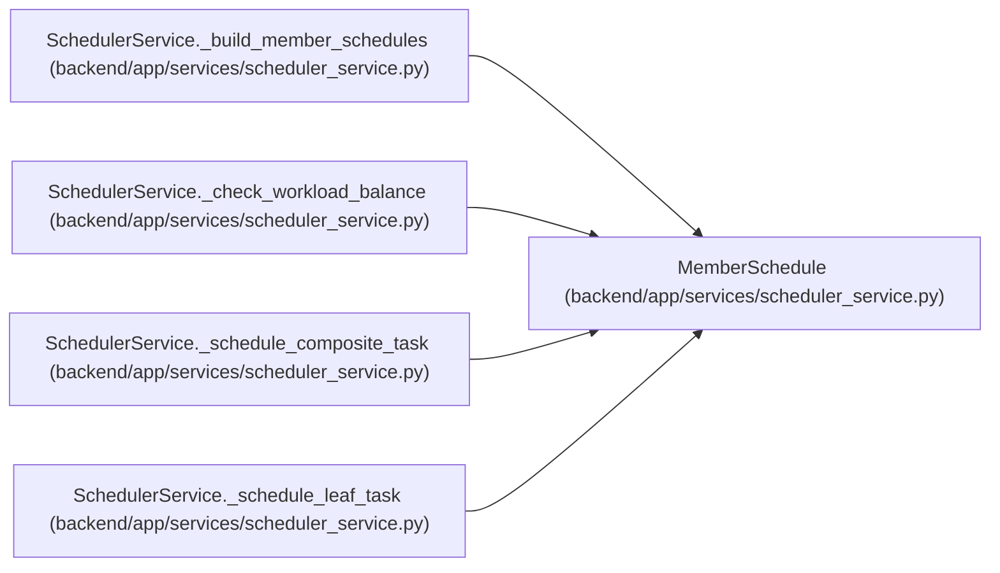

# MemberSchedule

**Location:** `backend/app/services/scheduler_service.py:61`
**Kind:** Class
**Bases:** —
**Module:** [scheduler_service](../modules/scheduler_service.md)

**Decorators:** `@dataclass`

## Description

Optimized schedule tracking with O(D) slot finding using sliding window.

Performance optimizations:
1. Date-to-index mapping for O(1) lookups
2. Lazy caching of available dates with invalidation
3. Sliding window algorithm for find_uninterrupted_slot (O(D) vs O(D²))

## Attributes

| Name | Type | Default | Description |
|------|------|---------|-------------|
| `member_id` | `int` | *required* | — |
| `member_name` | `str` | *required* | — |
| `capacity_days` | `float` | *required* | — |
| `working_dates` | `list[date]` | `field(default_factory=list)` | — |
| `vacation_dates` | `set[date]` | `field(default_factory=set)` | — |
| `holiday_dates` | `set[date]` | `field(default_factory=set)` | — |
| `weekend_days` | `set[int]` | `field(default_factory=lambda: {5, 6})` | — |
| `allocated_dates` | `dict[date, int]` | `field(default_factory=dict)` | — |
| `allocated_days` | `float` | `0.0` | — |
| `_date_to_idx` | `dict[date, int]` | `field(default_factory=dict, repr=False)` | — |
| `_available_cache` | `Optional[list[date]]` | `field(default=None, repr=False)` | — |
| `_cache_valid` | `bool` | `field(default=False, repr=False)` | — |

## Methods

| Method | Signature | Decorators | Description |
|--------|-----------|------------|-------------|
| `__post_init__` | `()` | — | Build date-to-index mapping after initialization. |
| `_rebuild_index` | `() -> None` | — | Build date-to-index mapping for O(1) lookups. |
| `_invalidate_cache` | `() -> None` | — | Invalidate the available dates cache. |
| `get_available_dates` | `() -> list[date]` | — | Get dates that are available (working and not allocated). |
| `can_schedule_uninterrupted` | `(start_date: date, effort_days: int) -> bool` | — | Check if task can be scheduled without interruption (no vacations in between). |
| `find_next_available_date` | `(earliest_start: date) -> Optional[date]` | — | Find the first available working date on or after earliest_start. |
| `find_uninterrupted_slot` | `(earliest_start: date, effort_days: int) -> Optional[date]` | — | Find the earliest date where effort_days contiguous working days are available. |
| `_is_projectable_working_day` | `(day: date) -> bool` | — | Working-day check for dates that may lie outside the iteration period. |
| `allocate` | `(start_date: date, effort_days: int, task_id: int, accounting_days: Optional[float] = None) -> tuple[date, date]` | — | Allocate dates for a task, returns (start, end). |

## Relationships

<!-- Auto-generated relationship summary. Do not edit by hand. -->

### Summary

| Module | Methods | Attributes |
|---|---:|---|
| [scheduler_service](../modules/scheduler_service.md) | 9 | `_available_cache`, `_cache_valid`, `_date_to_idx`, `allocated_dates`, `allocated_days`, `capacity_days`, `holiday_dates`, `member_id`, `member_name`, `vacation_dates`, `weekend_days`, `working_dates` |

### References

| Reference | Kind | Source | Call sites |
|---|---|---|---:|
| `SchedulerService._build_member_schedules` | call | [scheduler_service](../modules/scheduler_service.md) | 1 |
| `SchedulerService._build_member_schedules` | type_reference | [scheduler_service](../modules/scheduler_service.md) | — |
| `SchedulerService._check_workload_balance` | type_reference | [scheduler_service](../modules/scheduler_service.md) | — |
| `SchedulerService._schedule_composite_task` | type_reference | [scheduler_service](../modules/scheduler_service.md) | — |
| `SchedulerService._schedule_leaf_task` | type_reference | [scheduler_service](../modules/scheduler_service.md) | — |
