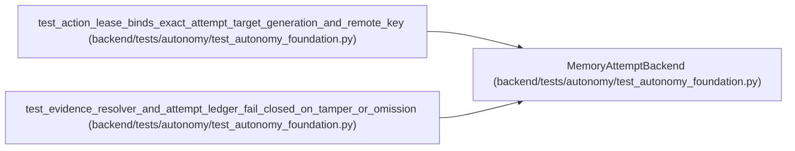

# MemoryAttemptBackend

**Location:** `backend/tests/autonomy/test_autonomy_foundation.py:181`
**Kind:** Class
**Bases:** —
**Module:** [test_autonomy_foundation](../modules/test_autonomy_foundation.md)

## Description

_Auto-generated from `MemoryAttemptBackend` in `backend/tests/autonomy/test_autonomy_foundation.py`._

## Attributes

*No annotated attributes found.*

## Methods

| Method | Signature | Decorators | Description |
|--------|-----------|------------|-------------|
| `__init__` | `() -> None` | — | — |
| `read` | `() -> AttemptLedgerSnapshot` | — | — |
| `compare_and_append` | `(*, expected_revision: int, expected_head_digest: str, record: AttemptLedgerRecord) -> bool` | — | — |

## Relationships

<!-- Auto-generated relationship summary. Do not edit by hand. -->

### Summary

| Module | Methods | Attributes |
|---|---:|---|
| [test_autonomy_foundation](../modules/test_autonomy_foundation.md) | 3 | — |

### References

| Reference | Kind | Source | Call sites |
|---|---|---|---:|
| `test_action_lease_binds_exact_attempt_target_generation_and_remote_key` | call | [test_autonomy_foundation](../modules/test_autonomy_foundation.md) | 1 |
| `test_evidence_resolver_and_attempt_ledger_fail_closed_on_tamper_or_omission` | call | [test_autonomy_foundation](../modules/test_autonomy_foundation.md) | 1 |
