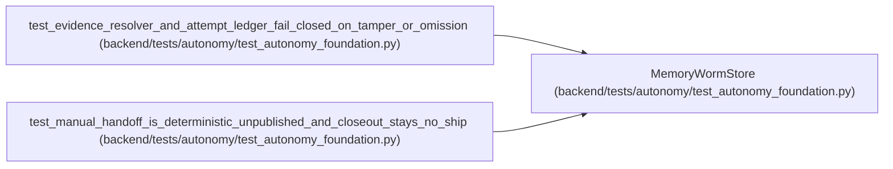

# MemoryWormStore

**Location:** `backend/tests/autonomy/test_autonomy_foundation.py:206`
**Kind:** Class
**Bases:** —
**Module:** [test_autonomy_foundation](../modules/test_autonomy_foundation.md)

## Description

_Auto-generated from `MemoryWormStore` in `backend/tests/autonomy/test_autonomy_foundation.py`._

## Attributes

*No annotated attributes found.*

## Methods

| Method | Signature | Decorators | Description |
|--------|-----------|------------|-------------|
| `__init__` | `() -> None` | — | — |
| `put_if_absent` | `(*, object_key: str, payload: bytes, redaction_class: RedactionClass) -> None` | — | — |
| `get` | `(*, object_key: str) -> bytes` | — | — |
| `ordered_keys` | `(*, prefix: str) -> tuple[str, ...]` | — | — |

## Relationships

<!-- Auto-generated relationship summary. Do not edit by hand. -->

### Summary

| Module | Methods | Attributes |
|---|---:|---|
| [test_autonomy_foundation](../modules/test_autonomy_foundation.md) | 4 | — |

### References

| Reference | Kind | Source | Call sites |
|---|---|---|---:|
| `test_evidence_resolver_and_attempt_ledger_fail_closed_on_tamper_or_omission` | call | [test_autonomy_foundation](../modules/test_autonomy_foundation.md) | 1 |
| `test_manual_handoff_is_deterministic_unpublished_and_closeout_stays_no_ship` | call | [test_autonomy_foundation](../modules/test_autonomy_foundation.md) | 1 |
